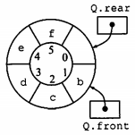

# 第二章 算法分析

## 2.1 最大连续子列和

```c++
int MaxSubSequenceSum1(const int arr[], int n)
{
    int MaxSum = 0;
    for (int i = 0; i < n; i++)
    {
        int ThisSum = 0;
        for (int j = i; j < n; j++)
        {
            ThisSum += arr[j];
            if (ThisSum > MaxSum)
                MaxSum = ThisSum;
        }
    }
    return MaxSum;
}
```

```c++
int MaxSubSequenceSum2(const int arr[], int Left, int Right)
{
    int MaxLeftSum, MaxRightSum;
    int MaxLeftBorderSum, MaxRightBorderSum;
    int LeftBorderSum, RightBorderSum;
    int Center, i;
    if (Left == Right)
        if (arr[Left] > 0)
            return arr[Left];
        else
            return 0;
    Center = (Left + Right) / 2;
    MaxLeftSum = MaxSubSequenceSum2(arr, Left, Center);
    MaxRightSum = MaxSubSequenceSum2(arr, Center + 1, Right);
    MaxLeftBorderSum = 0;
    LeftBorderSum = 0;
    for (i = Center; i >= Left; i--)
    {
        LeftBorderSum += arr[i];
        if (LeftBorderSum > MaxLeftBorderSum)
            MaxLeftBorderSum = LeftBorderSum;
    }
    MaxRightBorderSum = 0;
    RightBorderSum = 0;
    for (i = Center + 1; i <= Right; i++)
    {
        RightBorderSum += arr[i];
        if (RightBorderSum > MaxRightBorderSum)
            MaxRightBorderSum = RightBorderSum;
    }
    if (MaxLeftBorderSum + MaxRightBorderSum > MaxLeftSum && MaxLeftBorderSum + MaxRightBorderSum > MaxRightSum)
        return MaxLeftBorderSum + MaxRightBorderSum;
    else if (MaxLeftSum > MaxLeftBorderSum + MaxRightBorderSum && MaxLeftSum > MaxRightSum)
        return MaxLeftSum;
    else
        return MaxRightSum;
}
```

下面这种算法只对数据进行一次扫描，因此不需要数据被记忆。另外，在任意时刻算法都能对它已经读入的数据给出子序列问题的最佳答案，具有这种特性的算法叫做**联机算法**。仅需要常量空间并以线性时间运行的在线算法几乎是完美的算法。

```c++
int MaxSubSequenceSum3(const int arr[], int n)
{
    int ThisSum, MaxSum, j;
    ThisSum = MaxSum = 0;
    for (j = 0; j < n; j++)
    {
        ThisSum += arr[j];
        if (ThisSum > MaxSum)
            MaxSum = ThisSum;
        else if (ThisSum < 0)
            ThisSum = 0;
    }
    return MaxSum;
}
```

## 2.2 对分查找

```c++
int BinarySearch(const int arr[], int x, int n)
{
    int Low, Mid, High;
    Low = 0, High = n - 1;
    while (Low <= High)
    {
        Mid = (Low + High) / 2;
        if (arr[Mid] < x)
            Low = Mid + 1;
        else if (arr[Mid] > x)
            High = Mid - 1;
        else
            return Mid;
    }
    return -1;
}
```

## 2.3 欧几里德算法

```c++
unsigned int Gcd(unsigned int M, unsigned N)
{
    unsigned int Rem;
    while (N > 0)
    {
        Rem = M % N;
        M = N;
        N = Rem;
    }
    return M;
}
```

## 2.4 高效率的取幂运算

```c++
long long Pow(long long X, unsigned int N)
{
    if (N == 0)
        return 1;
    else if (N == 1)
        return X;
    else if (N % 2 == 0)
        return Pow(X * X, N / 2);
    else
        return Pow(X * X, N / 2) * X;
}
```


# 第三章 表、栈、队列

## 3.1 线性表

线性表是一个逻辑结构，有两种存储结构——顺序存储和链式存储。

---

### 链表

#### 单链表

相较于顺序表，链式存储线性表时不需要使用地址连续的存储单元。即不要求逻辑上相邻的元素在物理位置上也相邻。插入和删除操作不需要移动元素，只需要修改指针，但也会失去顺序表随机存储的优点。

---

```c++
//LinkList.h
typedef struct node {
	int data;
	node* next;
}Node,*LinkList;

LinkList ListHeadInsert(LinkList&); //头插法
LinkList ListTailInsert(LinkList&); //尾插法
Node* GetElem(LinkList, int); //根据位置获取元素
Node* LocateElem(LinkList, int); //根据元素定位位置
void FrontInsert(LinkList, int, int); //前插
void DeleteElem(LinkList, int); //删除
int GetLength(LinkList); //获取链表长度
```

```c++
//LinkList.cpp
#include<iostream>
#include"ListLink.h"

LinkList ListHeadInsert(LinkList& L)
{
	Node* p;
	int x;
	L = new Node; //创建头节点
	L->next = nullptr;
	std::cin >> x;
	while (std::cin)
	{
		p = new Node;
		p->data = x;
		p->next = L->next;
		L->next = p;
		std::cin >> x;
	}
	return L;
}

LinkList ListTailInsert(LinkList& L)
{
	int x;
	L = new Node;
	L->next = nullptr;
	Node* s = L;
	while (std::cin >> x)
	{
		Node* p = new Node;
		p->data = x;
		s->next = p;
		s = p;
	}
	return L;
}

Node* GetElem(LinkList L, int i)
{
	int j = 1;
	Node* p = L->next;
	if (i == 0) return L;
	if (i < 0) return nullptr;
	while (p && j++ < i)
	{
		p = p->next;
	}
	return p;
}

Node* LocateElem(LinkList L, int x)
{
	Node* p = L->next;
	while (p && p->data != x)
	{
		p = p->next;
	}
	return p;
}

void FrontInsert(LinkList L, int x, int i)
{
	Node* s = new Node;
	s->data = x;
	Node* front = GetElem(L, i - 1);
	s->next = front->next;
	front->next = s;
}

void DeleteElem(LinkList L, int i)
{
	if (i == 0) return;
	if (!GetElem(L, i)) return;
	Node* p = GetElem(L, i - 1);
	Node* q = GetElem(L, i);
	p->next = q->next;
	delete q;
}

int GetLength(LinkList L)
{
	int num = 0;
	Node* p = L->next;
	while (p&&++num) p = p->next;
	return num;
}
```

## 3.2 栈

栈的数学性质：n个不同的元素进栈，出栈元素不同排列的个数为
$$
{1\over{n+1}}{C^n_{2n}}
$$
上述公式称为卡特兰（Catalan）数。

---

### 顺序栈

```c++
//SqStack.h
#define MaxSize 50
typedef struct {
	int data[MaxSize];
	int top;
} SqStack;

void InitStack(SqStack&); //初始化栈
bool StackEmpty(SqStack); //判断栈是否为空
void Push(SqStack&, int); //进栈
void Pop(SqStack&); //出栈
int GetTop(SqStack&); //获取栈顶元素
void DestroyStack(SqStack&); //释放栈
```

```c++
//SqStack.cpp
#include"SqStack.h"

void InitStack(SqStack& S)
{
	S.top = -1;
}

bool StackEmpty(SqStack& S)
{
	if (S.top == -1) return true;
	else return false;
}

void Push(SqStack& S, int x)
{
	if (S.top == MaxSize - 1) return;
	S.data[++S.top] = x;
}

void Pop(SqStack& S)
{
	if (StackEmpty(S)) return;
	S.top--;
}

int GetTop(SqStack& S)
{
	return S.data[S.top];
}

void DestroyStack(SqStack& S)
{
	S.top = -1;
}
```

### 共享栈

利用栈底位置相对不变的特性，让两个顺序栈共享一个一维数组空间，将两个栈的栈底分别设置在共享空间的两端，两个栈顶向共享空间的中间延申。

### 链栈（栈的链式存储结构）

**优点**：便于多个栈共享存储空间和提高效率，且不存在栈满的情况，通常用单链表实现，并规定所有操作都是在单链表的表头进行。

---

栈的链式存储结构可描述为：

```c++
typedef struct LinkNode{
    ElemType data;
    struct LinkNode* next;
} *LinkStack;
```

## 3.3 队列

### 队列的顺序存储

顺序存储存在“假溢出”的情况，会造成空间浪费。

#### 循环队列

针对顺序存储“假溢出”的情况，在逻辑上将存储队列元素的表视为一个环。当队首指针**Q.front==MaxSize-1**后，再前进一个位置就自动到0，这可以利用取余来实现。

---

循环队列的判空，**Q.front==Q.rear**，但是无法区分队空还是队满。常用的方法是牺牲一个单元来区分队空和队满，入队时少用一个队列单元，以队头指针在队尾指针的下一位置作为队满的标志。



队满条件：(Q.rear+1)%MaxSize==Q.front

队空条件：Q.front==Q.rear

队列中元素的个数：(Q.rear-Q.front+MaxSize)%MaxSize

类型中增设表示元素个数的数据成员和tag数据成员，tag数据成员用于区分是队满还是队空。若因删除导致Q.front==Q.rear，则为队空；tag=1时，若因插入导致Q.front==Q.rear，则为队满。

---

```c++
//SqQueue.h
#define MaxSize 50

typedef struct {
	int data[MaxSize];
	int front, rear;
}SqQueue;

void InitQueue(SqQueue&); //初始化队列
bool IsEmpty(const SqQueue&); //判断队列是否为空
void EnQueue(SqQueue&, const int); //进队
int DeQueue(SqQueue&); //出队，并返回出队元素
int GetHead(SqQueue&); //获取对头元素
```

```c++
//SqQueue.cpp
#include<iostream>
#include"SqQueue.h"

void InitQueue(SqQueue& Q)
{
	Q.rear = Q.front = 0;
}

bool IsEmpty(const SqQueue& Q)
{
	if (Q.rear == Q.front) return true;
	return false;
}

void EnQueue(SqQueue& Q, const int x)
{
	if ((Q.rear + 1) % MaxSize == Q.front) return;
	Q.data[Q.rear] = x;
	Q.rear = (Q.rear + 1) % MaxSize;
}

int DeQueue(SqQueue& Q)
{
	if (Q.rear == Q.front) return false;
	int x = Q.data[Q.front];
	Q.front = (Q.front + 1) % MaxSize;
	return x;
}

int GetHead(SqQueue& Q)
{
	if (Q.rear == Q.front) std::exit(-1);
	return Q.data[Q.front];
}
```

### 队列的链式存储

实质是一个同时带有队头指针和队尾指针的单链表。头指针指向队头结点，尾指针指向队尾结点。

链式存储结构可描述为：

```c++
//LinkQueue.h
typedef struct LinkNode { //链式队列结点
	int data;
	struct LinkNode* next;
}LinkNode;

typedef struct { //链式队列，头出尾进
	LinkNode* front, * rear;
}LinkQueue;
```

---

通常将链式队列设计成一个带头结点的单链表，这样进队和出队的操作就统一了。另外，假如要使用多个队列最好使用链式队列。

---

```c++
//LinkQueue.h
void InitQueue(LinkQueue&); //队列初始化
bool IsEmpty(LinkQueue&); //判空
void EnQueue(LinkQueue&, int); //进队
bool DeQueue(LinkQueue&, int&); //出队，并返回出队元素
```

```c++
//LinkQueue.cpp
#include"LinkQueue.h"
void InitQueue(LinkQueue& Q)
{
	Q.front = Q.rear = new LinkNode;
	Q.front->next = nullptr;
}

bool IsEmpty(LinkQueue& Q)
{
	if (Q.front == Q.rear) return true;
	return false;
}

void EnQueue(LinkQueue& Q, int x)
{
	LinkNode* p = new LinkNode;
	p->data = x;
	Q.rear->next = p;
	Q.rear = p;
}

bool DeQueue(LinkQueue& Q, int& x)
{
	if (Q.front == Q.rear) return false;
	LinkNode* p = Q.front->next;
	x = p->data;
	Q.front->next = p->next;
	if (Q.rear == p) Q.rear = Q.front;
	delete p;
	return true;
}
```


# 第七章 排序

## 7.1 插入排序

### 算法实现

```c++
void InsertSort(int arr[],int n)
{
    int j,p;
    int tmp;
    for(p=1;p<n;p++)
    {
        tmp=arr[p];
        for(j=p;j>0&&arr[j-1]>tmp;j--) arr[j]=arr[j-1];
        arr[j]=tmp;
    }
}
```

---

### 算法分析

插入排序的平均情形也是O(N^2)。

插入排序的运行时间是O(I+N)，其中I为原始数组中的逆序数。

定理：

N个互异数的数组的平均逆序数是N(N-1)/4。

## 7.2 希尔排序（缩小增量排序）

### 算法实现（使用希尔增量为例）

```c++
void ShellSort(int A[],int N)
{
    int i,j,Increment;
    int tmp;
    for(Increment=N/2;Increment>0;Increment/=2)
    	for{i=Increment;i<N;i++}
    {
        tmp=A[i];
        for(j=i;j>=Inrement;j-=Increment)
            if(tmp<A[j-Increment])
                A[j]=A[j-Increment];
        	else
                break;
        A[j]=tmp;
    }
}
```

### 算法分析

希尔排序的运行时间依赖于增量序列的选择。

希尔排序的递推公式：
$$
h_t={n\over2},h_k={h_{k+1}\over2}
$$
定理：使用希尔增量时希尔排序的最坏情形运行时间为O(N^2)。

```

```

Hibbard增量序列的递推公式：
$$
h_1=1,h_i=2*h_{i-1}+1
$$
定理：使用Hibbard增量的希尔排序的最坏情形运行时间为O(N^(3/2))。
