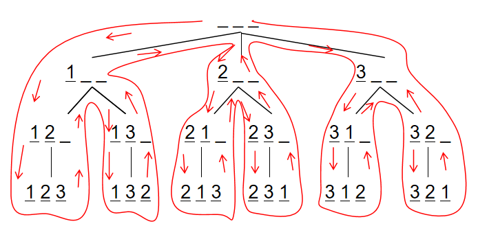
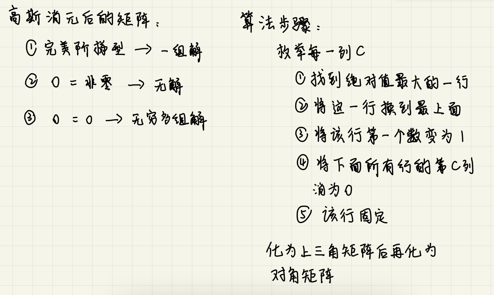

# 	一、基础算法

## 1、排序

### 插入排序

#### 算法实现

```c++
void InsertSort(int* arr,int n)
{
    int j,p;
    int tmp;
    for(p=1;p<n;p++)
        for(j=p;j>0&&arr[j-1]>arr[j];j--)
            swap(arr, j, j-1); 
}

void swap(int* arr, int i, int j)
{
	int temp = arr[i];
	arr[i] = arr[j];
	arr[j] = temp;
}
```


#### 算法分析

时间复杂度为O(N^2)，只考虑最坏情况。但在某些情况下，插入排序是优于冒泡排序的。


### 希尔排序

#### 算法实现（使用希尔增量为例）

```c++
void ShellSort(int A[],int N)
{
    int i,j,Increment;
    int tmp;
    for(Increment=N/2;Increment>0;Increment/=2)
    	for{i=Increment;i<N;i++}
    {
        tmp=A[i];
        for(j=i;j>=Inrement;j-=Increment)
            if(tmp<A[j-Increment])
                A[j]=A[j-Increment];
        	else
                break;
        A[j]=tmp;
    }
}
```


#### 算法分析

希尔排序的运行时间依赖于增量序列的选择。

希尔排序的递推公式：
$$
h_t={n\over2},h_k={h_{k+1}\over2}
$$
定理：使用希尔增量时希尔排序的最坏情形运行时间为O(N^2)。

```

```

Hibbard增量序列的递推公式：
$$
h_1=1,h_i=2*h_{i-1}+1
$$
定理：使用Hibbard增量的希尔排序的最坏情形运行时间为O(N^(3/2))。


### 选择排序

#### 算法实现

```c++
int* SelectSort(int* arr, int n)
{
	for (int i = 0; i < n - 1; i++)
	{
		int minIndex = i;
		for (int j = i + 1; j < n; j++)
			minIndex = arr[minIndex] < arr[j] ? minIndex : j;
		swap(arr, minIndex, i);
	}
	return arr;
}

void swap(int* arr, int i, int j)
{
	int temp = arr[i];
	arr[i] = arr[j];
	arr[j] = temp;
}
```


#### 算法分析

因为额外开辟了一个i和j，以及一个minIndex，minIndex每次for循环结束释放，再进入for循环时重新开辟，所以额外空间复杂度为*O(1)*


### 冒泡排序

```c++
int* BubbleSort(int* arr, int n)
{
	for (int e = n - 1; e > 0; e--)
	{
		for (int i = 0; i < e; i++)
			if (arr[i] > arr[i + 1]) swap(arr, i, i + 1);
	}
	return arr;
}

void swap(int* arr, int i, int j)
{
	int temp = arr[i];
	arr[i] = arr[j];
	arr[j] = temp;
}

//使用异或进行交换，交换的两个必须是独立的内存空间，在数组中即i位置不能等于j位置
void swap2(int*arr, int i,int j)
{
    arr[i] = arr[i]^arr[j];
    arr[j] = arr[i]^arr[j];
    arr[i] = arr[i]^arr[j];
}
```


### 快速排序

```c++
#include<iostream>

using namespace std;

const int N=1e6+10;

int q[N],n;

void quicksort(int* q,int l,int r)
{ 
	if(l==r) return;
	
	int i=l-1,j=r+1,x=q[(l+r+1)/2]; // 注意边界
	
	while(i<j)
	{
		while(q[++i]<x);
		while(q[--j]>x);
		if(i<j) swap(q[i],q[j]);
	}
	
	quicksort(q,l,i-1);
	quicksort(q,i,r);
}

int main()
{
	cin>>n;
	for(int i=0;i<n;i++) scanf("%d",&q[i]);
	
	quicksort(q,0,n-1);
	
	for(int i=0;i<n;i++) printf("%d ",q[i]);
	return 0;
}
```


#### 快速选择算法

```c++
#include<iostream>

using namespace std;

const int N=100010;

int n,k; // 数组中第k个小的数
int q[N];

int quicksort(int l,int r,int k)
{
	if(l==r) return q[l];
	
	int x=q[l],i=l-1,j=r+1;
	while(i<j)
	{
		while(q[++i]<x);
		while(q[--j]>x);
		if(i<j) swap(q[i],q[j]);
	}
	
	int sl=j-l+1;
	if(k<=sl) return quicksort(l,j,k);
	
	return quicksort(j+1,r,k-sl);
}

int main()
{
	cin>>n>>k;
	for(int i=0;i<n;i++) cin>>q[i];
	
	cout<<quicksort(0,n-1,k)<<endl;
	
	return 0;
}
```


### 归并排序

```c++
void MergeSort(int* arr, int l, int r)
{
	if (l == r) return;
	int mid = (r + l) / 2;
	MergeSort(arr, l, mid), MergeSort(arr, mid + 1, r);

	int k = 0, i = l, j = mid + 1, tmp[10000];
	while (i <= mid && j <= r)
		if (arr[i] <= arr[j]) tmp[k++] = arr[i++];
		else tmp[k++] = arr[j++];
    
	while (i <= mid) tmp[k++] = arr[i++];
	while (j <= r) tmp[k++] = arr[j++];
	
	for (i = l, j = 0; i <= r; i++, j++) arr[i] = tmp[j];
}	
```


#### 逆序对的数量

```c++
typedef long long LL;
LL mergesort(int *arr,int l,int r)
{
	if(l==r) return 0;
    int mid=(l+r)/2;
    LL res=mergesort(arr,l,mid)+mergesort(arr,mid+1,r);
    
    int k=0,tmp[100010],i=l,j=mid+1;
    while(i<mid&&j<=r)
    {
        if(arr[i]<=arr[j]) tmp[k++]=arr[i++];
        else
        {
            tmp[k++]=arr[j++];
            res+=mid-i+1;
        }
    }
    while(i<=mid) tmp[k++]=arr[i++];
    while(j<=r) tmp[k++]=arr[j++];
    
    for(i=l,j=0;i<=r;i++j++) arr[i]=tmp[j];
}
```


## 2、二分

### 整数二分模板

```c++
//区间[l, r]被划分成[l, mid]和[mid + 1, r]时使用
int bsearch_1(int l, int r)
{
    while(l < r)
    {
        int mid = ( l + r ) / 2;
        if (check(mid)) r = mid;
        else l = mid + 1;
    }
    return l;
}

//区间[1, r]被分成[1, mid - 1]和[mid, r]
int bsearch_2(int l, int r)
{
    while(l < r)
    {
        int mid = (1 + r + l)/2;
        if(check(mid)) l = mid;
        else r = mid - 1;
    }
    return l;
}
```

### 浮点数的二分

```c++
#include<iostream>

using namespace std;

int main()
{
	double x;
	cin>>x;
	
	double l=-10000,r=10000;
	while(r-l>1e-8)
	{
		double mid=(r+l)/2;
		if(mid*mid*mid>=x) r=mid;
		else l=mid;	
	} 
	
	printf("%lf",l);
	return 0;
}
```


## 3、高精度

### 高精度加法

```c++
#include<iostream>
#include<vector>

using namespace std;

vector<int> add(vector<int>& A,vector<int>& B)
{
	vector<int> C;
	int t=0; //进位
	for(int i=0;i<A.size()||i<B.size();i++)
	{
		if(i<A.size()) t+=A[i];
		if(i<B.size()) t+=B[i];
		C.push_back(t%10);
		t/=10;
	}
	if(t) C.push_back(1);
	return C;	
}

int main()
{
	string a,b;
	cin>>a>>b;
	vector<int> A,B;
	for(int i=a.size()-1;i>=0;i--) A.push_back(a[i]-'0');
	for(int i=b.size()-1;i>=0;i--) B.push_back(b[i]-'0');
	
	vector<int> C=add(A,B);
	for(int i=C.size()-1;i>=0;i--) cout<<C[i];
	cout<<endl;
	
	return 0;
}
```


### 高精度减法

```c++
#include<iostream>
#include<vector>

using namespace std;

// 判断是否有A>=B
bool cmp(vector<int>& A,vector<int>& B)
{
	if(A.size()!=B.size()) return A.size()>B.size();
	for(int i=A.size()-1;i>=0;i--)
		if(A[i]!=B[i]) return A[i]>B[i];
	return true;
}

// A>=B 
vector<int> sub(vector<int>& A,vector<int>& B)
{
	vector<int> C;
    int t=0; // 借位
	for(int i=0;i<A.size();i++)
	{
		t=A[i]-t;
		if(i<B.size()) t-=B[i];
		C.push_back((t+10)%10);
		if(t<0) t=1;
		else t=0;
	}
	while(C.size()>1&&C.back()==0) C.pop_back(); // 去掉前导0
	return C;
}

int main()
{
	string a,b;
	vector<int> A,B;
	cin>>a>>b;
	for(int i=a.size()-1;i>=0;i--) A.push_back(a[i]-'0');
	for(int i=b.size()-1;i>=0;i--) B.push_back(b[i]-'0');
	
	if(cmp(A,B))
	{
		vector<int> C=sub(A,B);
		for(int i=C.size()-1;i>=0;i--) cout<<C[i];
	}
	else
	{
		vector<int> C=sub(B,A);
		cout<<"-";
		for(int i=C.size()-1;i>=0;i--) cout<<C[i];
	}
	return 0;
}
```


### 高精度乘法

一个高精度的整数 × 一个较小的数

```c++
#include<iostream>
#include<vector>

using namespace std;

vector<int> mul(vector<int>& A,int b)
{
	vector<int> C;
	int t=0;
	for(int i=0;i<A.size()||t;i++) 
	{
		if(i<A.size()) t+=A[i]*b;
		C.push_back(t%10);
		t/=10;
	}
    
    while(C.size()>1&&C.back()==0) C.pop_back();
	
	return C;
}

int main()
{
	string a;
	int b;
	cin>>a>>b;
    
	vector<int> A;
	for(int i=a.size()-1;i>=0;i--) A.push_back(a[i]-'0');
    
	vector<int> C=mul(A,b);
	for(int i=C.size()-1;i>=0;i--) cout<<C[i];
    
	return 0;
}
```


### 高精度除法

一个高精度的整数 ÷ 一个较小的数

```c++
#include<iostream>
#include<vector>
#include<algorithm>

using namespace std;

// 商是C，余数是r
vector<int> div(vector<int>& A,int b,int& r)
{
	vector<int> C;
	r=0;
	for(int i=A.size()-1;i>=0;i--)
	{
		r=r*10+A[i];
		C.push_back(r/b);
		r%=b;
	}
	
	reverse(C.begin(),C.end()); // #include<algorithm>
	
	while(C.size()>1&&C.back()==0) C.pop_back(); // 去掉前导0
	
	return C;
}

int main()
{
	string a;
	int b;
	cin>>a>>b;
	
	vector<int> A;
	for(int i=a.size()-1;i>=0;i--) A.push_back(a[i]-'0');
	
	int r;
	vector<int> C=div(A,b,r);
	
	for(int i=C.size()-1;i>=0;i--) cout<<C[i];
	cout<<endl<<r<<endl;
	
	return 0;
}
```


## 4、前缀和与差分

### 前缀和

#### 一维前缀和

- 公式
  $$
  S_{[l,r]}=S_l-S_{[r-1]}
  $$

```c++
#include<iostream>

using namespace std;

const int N=100010;

int n,m;
int a[N],s[N]; // 全局定义的数组初始化为0 

int main()
{
	scanf("%d%d",&n,&m);
	for(int i=1;i<=n;i++) scanf("%d",&a[i]);
	
	for(int i=1;i<=n;i++) s[i]=s[i-1]+a[i]; // 前缀和的初始化
	
	while(m--)
	{
		int l,r;
		scanf("%d%d",&l,&r);
		printf("%d\n",s[r]-s[l-1]); // 区间和的计算
	}
	
	return 0;
}
```


#### 二维前缀和

- 公式

$$
s_{[i,j]}=s_{[i,j-1]}+s_{[i-1,j]}-s_{[i-1,j-1]}+a_{[i,j]}
$$

- 某一矩形区域内的和，左上角为[x1,y1]，右上角为[x2,y2]

$$
s_{[x2,y2]}-s_{[x1-1,y2]}-s_{[x2,y1-1]}+s_{[x1-1,y1-1]}
$$

```c++
#include<iostream>
using namespace std;

const int N=1010;

int n,m,q;
int a[N][N],s[N][N];


int main()
{
	scanf("%d%d%d",&n,&m,&q);
	for(int i=1;i<=n;i++)
		for(int j=1;j<=m;j++)
			scanf("%d",&a[i][j]);
			
	for(int i=1;i<=n;i++)
		for(int j=1;j<=m;j++)
			s[i][j]=s[i-1][j]+s[i][j-1]-s[i-1][j-1]+a[i][j]; // 前缀和
			
	while(q--)
	{
		int x1,y1,x2,y2;
		scanf("%d%d%d%d",&x1,&y1,&x2,&y2);
		printf("%d\n",s[x2][y2]-s[x1-1][y2]-s[x2][y1-1]+s[x1-1][y1-1]); //某个矩形范围内的和
	}
	return 0;
}
```


### 差分

#### 一维数组

```c++
#include<iostream>

using namespace std;

const int N=100010;
int n,m;
int s[N],b[N]; // b为差分数组

void insert(int l,int r,int c)
{
	b[l]+=c;
	b[r+1]-=c;
}

int main()
{
	scanf("%d%d",&n,&m);
	for(int i=1;i<=n;i++) scanf("%d",&s[i]); // 构造前缀和数组 
	
	for(int i=1;i<=n;i++) insert(i,i,s[i]); //  构造差分数组 
	
	while(m--)
	{
		int l,r,c;
		scanf("%d%d%d",&l,&r,&c);
		insert(l,r,c);
	}
	
	for(int i=1;i<=n;i++) b[i]+=b[i-1]; // 将差分数组改为前缀和数组 
	
	for(int i=1;i<=n;i++) printf("%d ",b[i]); 
	
	return 0;
}
```

#### 差分矩阵

```c++
#include<iostream>

using namespace std;

const int N=1010;

int n,m,q;
int s[N][N],b[N][N];

void insert(int x1,int y1,int x2,int y2,int c)
{
	b[x1][y1]+=c;
	b[x2+1][y1]-=c;
	b[x1][y2+1]-=c;
	b[x2+1][y2+1]+=c;
}

int main()
{
	scanf("%d%d%d",&n,&m,&q);
	
	for(int i=1;i<=n;i++)
		for(int j=1;j<=m;j++)
			scanf("%d",&s[i][j]); // 构造前缀和数组 
			
	for(int i=1;i<=n;i++)
		for(int j=1;j<=m;j++)
			insert(i,j,i,j,s[i][j]); // 构造差分数组 
	
	while(q--)
	{
		int x1,y1,x2,y2,c;
		cin>>x1>>y1>>x2>>y2>>c;
		insert(x1,y1,x2,y2,c);
	}
	
	for(int i=1;i<=n;i++)
		for(int j=1;j<=m;j++)
			b[i][j]+=b[i-1][j]+b[i][j-1]-b[i-1][j-1]; // 将差分数组改为前缀和数组
	
	for(int i=1;i<=n;i++)
	{
		for(int j=1;j<=m;j++) printf("%d ",b[i][j]);
		printf("\n");
	}
	
	return 0;
}
```


## 5、双指针算法

> 题目：给定包含若干个单词的字符串，每个单词用空格隔开，将每个单词分开。

```c++
#include<iostream>
#include<string.h>
using namespace std;

int main()
{
	char str[1000];
	gets(str);
	
	int n=strlen(str);
	
	for(int i=0;i<n;i++)
	{
		int j=i;
		while(j<n&&str[j]!=' ') j++;
		
		for(int k=i;k<j;k++) cout<<str[k];
		cout<<endl;
		
		i=j;
	}
	return 0;
}
```

```c++
#include<iostream>
#include<string.h>
using namespace std;

int main()
{
	char str[1000];
	gets(str);
	
	int n=strlen(str);
	
	for(int i=0;i<n;i++)
	{
		int j=i;
		while(j<n&&str[j]!=' ') j++; // j遇到空格停止 
		
		for(;i!=j;i++)
			cout<<str[i];
		cout<<endl; 
	}
	return 0;
}
```


> 最长连续不重复子序列：给定一个长度为 n 的整数序列，找出最长的不包含重复的数的连续区间，输出它的长度。

```c++
#include<iostream>

using namespace std;

const int N=100010;
int n;
int a[N],s[N]; // s数组维护序列中每个数字出现的次数

int main()
{
	cin>>n;
	for(int i=0;i<n;i++) cin>>a[i];
	
	int res=0;
	
	for(int i=0,j=0;i<n;i++)
	{
		s[a[i]] ++;
		while(j<i&&s[a[i]]>1) s[a[j++]] --;		 
		res=max(res,i-j+1);	
	}
	
	cout<<res<<endl;
	
	return 0;
}
```


## 6、位运算

> 判断n的二进制表示的第k位是几

```c++
int res = n>>k&1;
```


> 返回n的二进制表示中最后一个1

```c++
/*
在c++中，一个整数的负数是补码的概念，也就是取反＋！
即 -x = ~x + 1
因此 x&-x = x&(~x+1)
最简单的应用为统计x的二进制表示中1的个数
*/

int lowbit(int x)
{
    return x&-x;
}
```


## 7、离散化

**下面示例中的 `find函数` 是离散化的关键**

```c++
#include<iostream>
#include<vector>
#include<algorithm>

using namespace std;

const int N = 300010; // n次插入和m次查询操作所涉及到的最多的坐标数量
int n,m; // n次插入和m次查询
int a[N]; // 存储坐标插入的值
int s[N]; //数组a的前缀和数组
vector<int> alls; // 存储n次插入和m次查询涉及的坐标，以此来离散化
vector<pair<int,int> > add, query; // 存储插入和查询操作的数据

int find(int x) // 返回输入坐标x的离散化坐标
{
	int l=0,r=alls.size()-1;
	while(l<r)
	{
		int mid=(l+r)/2;
		if(alls[mid]>=x) r=mid;
		else l=mid+1;
	}
	return r+1;
}  

int main()
{
	scanf("%d%d",&n,&m);
	for(int i=1;i<=n;i++)
	{
		int x,c;
		scanf("%d%d",&x,&c);
		add.push_back({x,c});
		alls.push_back(x);
	}
	
	for(int i=1;i<=m;i++)
	{
		int l,r;
		scanf("%d%d",&l,&r);
		query.push_back({l,r});
		alls.push_back(l);
		alls.push_back(r);
	}
	
	// 排序，去重
	sort(alls.begin(),alls.end());
	alls.erase(unique(alls.begin(),alls.end()),alls.end());
	
	// 执行前n次插入操作
	for(auto item : add)
	{
		int x=find(item.first);
		a[x] += item.second;	
	} 
	
	// 前缀和
	for(int i=1;i<=alls.size();i++) s[i]=s[i-1]+a[i];
	
	// 处理后m次查询操作
	for(auto item : query)
	{
		int l=find(item.first);
		int r=find(item.second);
		printf("%d\n",s[r]-s[l-1]);
	} 
	
	return 0;
}
```

## 8、区间和并

快速地将有交集的区间合并

```c++
#include<iostream>
#include<vector>
#include<algorithm>

using namespace std;

vector<pair<int,int> > segs;

int main()
{
	vector<pair<int,int> > res;
	
	int st=-1e9-10,ed=-1e9-10;
	int n;
	cin>>n;
	while(n--)
	{
		int l,r;
		cin>>l>>r;
		segs.push_back({l,r});
	}
	
	sort(segs.begin(),segs.end());
	
	for(auto seg:segs)
	{
		if(ed<seg.first) // 该区间不能合并
		{
			if(ed!=-1e9-10) res.push_back({st,ed}); // 判断是否是第一个区间
			st=seg.first,ed=seg.second; // 维护正在遍历的区间
		}
		else if(ed<seg.second) ed=seg.second; // 合并正在遍历的区间
	}
	
	res.push_back({st,ed}); // 将最后一次合并完成的区间加入
	
	printf("%d",res.size());
	
	return 0;
} 
```


# 二、数据结构

## 1、链表

### 单链表

```c++
#include<iostream>

using namespace std;

const int N=100010;

// head 表示头节点的下标
// e[i] 表示节点i的值
// ne[i] 表示节点i的next指针是多少
// idx 存储当前已经用到了哪个点 
int head,e[N],ne[N],idx;

// 初始化 
void init()
{
	head=-1;
	idx=0;
}

// 将x插到头节点 
void add_to_head(int x) 
{
	e[idx]=x;
	ne[idx]=head;
	head=idx;
	idx++;	
}

// 将x插入到下标是k的节点的后面 
void add(int k,int x)
{
	e[idx]=x;
	ne[idx]=ne[k];
	ne[k]=idx;
	idx++;
}

// 将下标是k的节点的后面的节点删掉 
void remove(int k)
{
	ne[k]=ne[ne[k]];
}


int main()
{
	// 一系列操作 
	return 0;
}
```


### 双链表

```c++
#include<iostream>
using namespace std;

const int N=100010;

int m;
int e[N],l[N],r[N],idx;

void init()
{
	r[0]=1,l[1]=0;
	idx=2;
}

// 在k位置的前面加入x
void add(int k,int x)
{
	e[idx]=x;
	r[idx]=r[k];
	l[idx]=k;
	l[r[k]]=idx;
	r[k]=idx;
	idx++;
}

void remove(int k)
{
	l[r[k]]=l[k];
	r[l[k]]=r[k];
}

int main()
{
	init();
	cin>>m;
	int k,x;
	string op;
	while(m--)
	{
		cin>>op;
		if(op=="R")
		{
			cin>>x;
			add(l[1],x);
		}
		else if(op=="L")
		{
			cin>>x;
			add(0,x);
		}
		else if(op=="D")
		{
			cin>>k;
			remove(k+1);
		}
		else if(op=="IL")
		{
			cin>>k>>x;
			add(l[k+1],x);
		}
		else
		{
			cin>>k>>x;
			add(k+1,x);
		}
	}
	
	for(int i = r[0]; i != 1; i = r[i]) printf("%d ",e[i]);

	return 0;
}
```


## 2、栈和队列

### 栈

```c++
#include<iostream>

using namespace std;

const int N=100010;

// tt为栈顶 
int stk[N],tt=0;

int main()
{
	int m;
	cin>>m;
	while(m--)
	{
		string op;
		int x;
		
		cin>>op;
		if(op=="push")
		{
			cin>>x;
			stk[++tt]=x; 
		}
		else if(op=="pop") tt--;
		else if(op=="empty") cout<<(tt?"NO":"YES")<<endl;
		else cout<<stk[tt]<<endl;
	}
	return 0;
}
```


### 队列

```c++
#include <iostream>

using namespace std;

const int N = 100010;

int m;
int q[N], hh, tt = -1; // hh 为尾， tt 为头，尾进头出

int main()
{
	cin>>m;
	while(m--)
	{
		string op;
		int x;
		
		cin>>op;
		if(op=="push")
		{
			cin>>x;
			q[++tt]=x;
		}
		else if(op=="pop") hh++;
		else if(op=="empty") cout << (hh<=tt?"NO":"YES") <<endl;
		else cout<<q[hh]<<endl;
	}
	
	return 0;
}
```


### 单调栈

> 题目：给定一个长度为 N 的整数数列，输出每个数左边第一个比它小的数，如果不存在则输出 −1。

```c++
#include<iostream>

using namespace std;

const int N=100010;

int n;
int stk[N],tt;

int main()
{
	scanf("%d",&n);
	
	for(int i=0;i<n;i++)
	{
		int x;
		scanf("%d",&x);
		while(tt&&stk[tt]>=x) tt--;
		if(tt) printf("%d ",stk[tt]);
		else printf("-1 ");
		
		stk[++tt] = x;
	}
	
	return 0;
}
```


### 单调队列

```c++
#include<iostream>

using namespace std;

const int N=1000010;
int a[N],q[N],hh,tt=-1;

int main()
{
	int n,k;
	scanf("%d%d",&n,&k);
	for(int i=0;i<n;i++)
	{
		scanf("%d",&a[i]);
		if(i-k+1>q[hh]) hh++; // 队首出窗口，hh+1
		while(hh<=tt&&a[i]<=a[q[tt]]) tt--; // 队尾不单调，tt-1，双端队列 
		q[++tt]=i; // 下标加入到队尾中 
		if(i+1>=k) printf("%d ",a[q[hh]]);  // 队首要有数据才能输出 
	}
	cout<<endl;
	
	hh=0,tt=-1;
	for(int i=0;i<n;i++)
	{
		if(i-k+1>q[hh]) hh++;
		while(hh<=tt&&a[i]>=a[q[tt]]) tt--;
		q[++tt]=i;
		if(i+1>=k) printf("%d ",a[q[hh]]);
	}
	
	return 0;
}
```


## 3、KMP

- 视频讲解

<iframe src="//player.bilibili.com/player.html?aid=642197522&bvid=BV1AY4y157yL&cid=744834924&page=1" scrolling="no" border="0" frameborder="no" height="600" framespacing="0" allowfullscreen="true"> </iframe>


```c++
#include <iostream>

using namespace std;

const int N = 1000010;
char p[N], s[N]; // 用 p 来匹配 s
// “next” 数组，若第 i 位存储值为 k
// 说明 p[0...i] 内最长相等前后缀的前缀的最后一位下标为 k
// 即 p[0...k] == p[i-k...i]
int ne[N]; 
int n, m; // n 是模板串长度 m 是模式串长度

int main()
{
    cin >> n >> p >> m >> s;

    // p[0...0] 的区间内一定没有相等前后缀
    ne[0] = -1;

    // 构造模板串的 next 数组
    for (int i = 1, j = -1; i < n; i ++)
    {
        while (j != -1 && p[i] != p[j + 1])
        {
            // 若前后缀匹配不成功
            // 反复令 j 回退，直至到 -1 或是 s[i] == s[j + 1]
            j = ne[j];
        }
        if (p[i] == p[j + 1]) 
        {
            j ++; // 匹配成功时，最长相等前后缀变长，最长相等前后缀最后一位变大
        }
        ne[i] = j; // 令 ne[i] = j，以方便计算 next[i + 1]
    }

    // kmp start !
    for (int i = 0, j = -1; i < m; i ++)
    {
       while (j != -1 && s[i] != p[j + 1])
       {
           j = ne[j];
       }
       if (s[i] == p[j + 1])
       {
           j ++; // 匹配成功时，模板串指向下一位
       }
       if (j == n - 1) // 模板串匹配完成，第一个匹配字符下标为 0，故到 m - 1
       {
           // 匹配成功时，文本串结束位置减去模式串长度即为起始位置
           cout << i - j << ' ';

           // 模板串在模式串中出现的位置可能是重叠的
           // 需要让 j 回退到一定位置，再让 i 加 1 继续进行比较
           // 回退到 ne[j] 可以保证 j 最大，即已经成功匹配的部分最长
           j = ne[j]; 
       }
    }

   return 0;
}
```

## 4、Trie树

> 用来快速存储和查找字符串集合的一种数据结构

```c++
/* 
一维是结点总数，而结点和结点之间的关系（谁是谁儿子）存在第二个维度，比如[0][1]=3, [0]表示根节点，[1]表示它有一个儿子‘b’,这个儿子的下标是3；接着如果有一个[3][2]=8 ; 说明根节点的儿子‘b’也有一个儿子‘c’，这个孙子的下标就是8；这样传递下去，就是一个字符串。随便给一个结点[x][y], 并不能看出它在第几层，只能知道，它的儿子是谁。
*/

#include<iostream>

using namespace std;

const int N=100010;

int son[N][26],cnt[N],idx; // 下标是0的点，既是根节点，又是空节点
char str[N];

void insert(char str[])
{
	int p=0;
	for(int i=0;str[i];i++)
	{
		int u=str[i]-'a';
		if(!son[p][u]) son[p][u]= ++idx;
		p=son[p][u];	
	}	
	
	cnt[p]++;
}

int query(char str[])
{
	int p=0;
	for(int i=0;str[i];i++)
	{
		int u=str[i]-'a';
		if(!son[p][u]) return 0;
		p=son[p][u];
	}
	
	return cnt[p];
}

int main()
{
	int n;
	cin>>n;
	while(n--)
	{
		char op[2];
		scanf("%s%s",op,str);
		if(op[0]=='I') insert(str);
		else printf("%d\n",query(str));
	}
	
	return 0;
} 
```


## 5、并查集

> - 用途：
>
> 1. 将两个集合合并
> 2. 询问两个元素是否在一个集合当中
>
> - 关键：
>
> 1. find() 函数

```c++
/*
优化：路径压缩
*/

#include<iostream>

using namespace std;

const int N=1e5+10;

int n,m;
int p[N]; // father数组，存储的是每个元素的父节点

int find(int x) // 返回x的祖宗节点 + 路径压缩 
{
	if(p[x]!=x) p[x]=find(p[x]);
	return p[x];	
} 

int main()
{
	scanf("%d%d",&n,&m);
	for(int i=1;i<=n;i++) p[i]=i;
	
	while(m--)
	{
		char op[2];
		int a,b;
		scanf("%s%d%d",op,&a,&b);
		
		if(op[0]=='M') p[find(a)]=find(b);
		else
        {
			if(find(a)==find(b)) puts("Yes");
			else puts("No");
		}
	}
	
	return 0;
 } 
```


> 给定一个包含 n 个点（编号为 1∼n）的无向图，初始时图中没有边。
>
> 现在要进行 m 个操作，操作共有三种：
>
> 1. `C a b`，在点a和点b之间连一条边，a和b可能相等；
> 2. `Q1 a b`，询问点a和点b是否在同一个连通块中，a和b可能相等；
> 3. `Q2 a`，询问点a所在连通块中点的数量；

```c++
#include<iostream>

using namespace std;

const int N=100010;

int n,m;
int p[N],s[N]; // 额外开一个数组来维护每个集合中元素的数量

int find(int x)
{
	if(p[x]!=x) p[x]=find(p[x]);
	return p[x];	
} 

int main()
{
	scanf("%d%d",&n,&m);
	for(int i=1;i<=n;i++) p[i]=i,s[i]=1;
	
	while(m--)
	{
		char op[5];
		int a,b;
		scanf("%s",op);
		
		if(op[0]=='C')
		{
			scanf("%d%d",&a,&b);
			if(find(a)==find(b)) continue;
			s[find(b)]+=s[find(a)];
			p[find(a)]=find(b);
		}
		else if(op[1]=='1')
		{
			scanf("%d%d",&a,&b);
			if(find(a)==find(b)) puts("Yes");
			else puts("No");
		}
		else
		{
			scanf("%d",&a);
			printf("%d\n",s[find(a)]);
		}
	}
	
	return 0;
 } 
```


## 6、堆

> - 支持操作
>
> 1. 插入一个数
> 2. 求集合当中的最小值
> 3. 删除最小值
> 4. 删除任意一个元素
> 5. 修改任意一个元素


> 堆排序

```c++
/*
用一维数组存储一个堆
x的左儿子节点为2x，右儿子节点为2x+1
*/

#include<iostream>

using namespace std;

const int N=100010;

int n,m;
// h[i] 表示第i个结点存储的值，i从1开始，2*i是左子节点，2*i + 1是右子节点
// size 既表示堆里存储的元素个数，又表示最后一个结点的下标
int h[N],s; // 堆有两个变量h[N]，size; 怎么这里的size和文件里有冲突，只能改成s了

void down(int u)
{
	int t=u; // t表示3个数中的最小的结点的下标
	if(u*2<=s&&h[u*2]<h[t]) t=u*2;
	if(u*2+1<=s&&h[u*2+1]<h[t]) t=u*2+1;
	if(u!=t)
	{
		swap(h[u],h[t]);
		down(t);
	}
}

/*
堆的up操作
void up(int u)
{
	while(u/2&&h[u/2]>h[u])
	{
		swap(h[u/2],h[u]);
		u/=2;
	}
}
*/

int main()
{
	scanf("%d%d",&n,&m);
	for(int i=1;i<=n;i++) scanf("%d",&h[i]);
	s=n;
	
	for(int i=n/2;i;i--) down(i); // 把堆初始化成小根堆，从二叉树的倒数第二行开始，把数字大的下沉
	
	while(m--)
	{
		printf("%d ",h[1]);
		h[1]=h[s];
		s--;
		down(1);
	}
	
	return 0;
}
```


> 带映射的堆模拟

```c++
#include<iostream>
#include<algorithm>
#include<string.h>

using namespace std;

const int N=1e5+10;

int h[N],s,ph[N],hp[N]; // ph[k]=j表示存的第k个数在堆中的下标为j，hp[j]=k表示堆中下标为j的数是第k个存的数 

void heap_swap(int a,int b)
{
	swap(ph[hp[a]],ph[hp[b]]);
	swap(hp[a],hp[b]);
	swap(h[a],h[b]);
}

void down(int u)
{
	int t=u; // t表示3个数中的最小值 
	if(u*2<=s&&h[u*2]<h[t]) t=u*2;
	if(u*2+1<=s&&h[u*2+1]<h[t]) t=u*2+1;
	if(u!=t)
	{
		heap_swap(u,t);
		down(t);
	}
}

void up(int u)
{
	while(u/2&&h[u/2]>h[u])
	{
		heap_swap(u/2,u);
		u/=2;
	}
}

int main()
{
	int n,m=0;
	cin>>n;
	while(n--)
	{
		char op[10];
		int k,x;
		
		scanf("%s",op);
		if(!strcmp(op,"I"))
		{
			scanf("%d",&x);
			s++;
			m++;
			ph[m]=s,hp[s]=m;
			h[s]=x;
			up(s);
		}
		else if(!strcmp(op,"PM")) printf("%d\n",h[1]);
		else if(!strcmp(op,"DM"))
		{
			heap_swap(1,s);
			s--;
			down(1);
		}
		else if(!strcmp(op,"D"))
		{
			cin>>k;
			k=ph[k];
			heap_swap(k,s);
			s--;
			down(k),up(k);
		}
		else
		{
			cin>>k>>x;
			k=ph[k];
			h[k]=x;
			down(k),up(k);
			
		}
	}
	return 0;
}
```


## 7、Hash表

> - 作用：
>
> 1. 将一个庞大的值域映射到一个较小的值域中

### 存储结构

> - 解决冲突的方法：
>
> 1. 拉链法
> 2. 开放寻址法

```c++
// 拉链法

#include<iostream>
#include<cstring>

using namespace std;

const int N=100003;

int h[N];
int e[N],ne[N],idx;

void insert(int x)
{
	int k=(x%N+N)%N; // k为哈希值，保证为正 
	e[idx]=x,ne[idx]=h[k],h[k]=idx++; 
}

bool find(int x)
{
	int k=(x%N+N)%N;
	for(int i=h[k];i!=-1;i=ne[i])
		if(e[i]==x) return true;
	return false;
}

int main()
{
	int n;
	scanf("%d",&n);
	
	memset(h,-1,sizeof h); // 把h数组中的所有数都初始化为-1
	
	while(n--)
	{
		char op[2];
		int x;
		scanf("%s%d",op,&x);
		
		if(op[0]=='I') insert(x);
		else
		{
			if(find(x)) puts("Yes");
			else puts("No");
		}	
	}
	
	return 0;
}
```


```c++
// 开放寻址法

#include<iostream>
#include<cstring>
using namespace std;

const int N=200003,null=0x3f3f3f3f; 
// N为数据大小的2~3倍，质数，可以最大程度减少冲突 
// null 是一个不在数据范围内的数，用来表示空的坑

int h[N]; 

int find(int x)
{
	int t=(x%N+N)%N;
	
	while(h[t]!=null&&h[t]!=x)
	{
		t++;
		if(t==N) t=0;
	}
	return t;
}

int main()
{
	int n;
	scanf("%d",&n);
	
	memset(h,0x3f,sizeof h);
	
	while(n--)
	{
		char op[2];
		int x;
		scanf("%s%d",op,&x);
		
		if(op[0]=='I') h[find(x)]=x;
		else
		{
			if(h[find(x)]==null) puts("No");
			else puts("Yes");
		}
	}
	
	return 0;
}
```


### 字符串哈希

> 方法：字符串前缀哈希法


```c++
#include<iostream>

using namespace std;

typedef unsigned long long ULL;
const int N=100010,P=131; // P为进制。  P=131 or 13331 经验值 

int n,m;
char str[N];
ULL h[N],p[N]; // p数组存储P的幂 

ULL get(int l,int r) // ULL溢出代替了取模
{
	return h[r]-h[l-1]*p[r-l+1];
}

int main()
{
	scanf("%d%d%s",&n,&m,str+1);
	
	p[0]=1; // P的0次方为1
	for(int i=1;i<=n;i++)
	{
		p[i]=p[i-1]*P;
		h[i]=h[i-1]*P+str[i];
	}
	
	while(m--)
	{
		int l1,r1,l2,r2;
		scanf("%d%d%d%d",&l1,&r1,&l2,&r2);
		
		if(get(l1,r1)==get(l2,r2)) puts("Yes");
		else puts("No");
	}
	
	return 0;
}
```


## 8、C++STL使用技巧

### vector 

```c++
#include<cstdio>
#include<cstring>
#include<iostream>
#include<algorithm>
#include<vector>

using namespace std;

int main()
{
    vector<int> a(10,3); // 创建一个长度为10的vector，初始化为3
    vector<int> a[10]; // 创建一个vector数组
    
    a.size(); // 返回vector的长度，时间复杂度为O（1）
    a.empty(); // 返回vector是否为空，时间复杂度为O（1）
    a.clear(); // 清空
    a.front(); // 返回vector的第一个数
    a.back(); // 返回vector的最后一个数
    a.push_back(); // 向vector的最后插入一个数
    a.pop_back(); // 删除vector的最后一个数
    a.begin(),a.end(); // begin是第0个数，end是最后一个数后面的那个数
    
    for(vector<int>::iterator i=a.begin();i!=a.end();i++) cout<<*i<<endl; // 迭代器
    
    // 支持比较运算
}
```


### string

```c++
str.size(); // 返回字符个数
str.empty(); // 是否为空
str.clear(); // 清空
str.substr(idx,size); // 返回一个字串，第一个参数为起始下标，第二个参数为长度（可省略）
str.c_str(); // 返回str的起始地址
```


### queue

```c++
push(); // 向队尾插入一个元素
front(); // 返回队头元素
back(); // 返回队尾元素
pop(); // 弹出队头元素
size();
empty();
```


### priority queue（heap）

```c++
// 默认是大根堆
push(); // 插入一个元素
top(); // 返回堆顶元素
pop(); // 弹出堆顶元素

heap.push(-x); // 小根堆
priority_queue<int,vector<int>,greater<int> > heap; // 定义一个小根堆
```


### stack

```c++
push(); // 向栈顶加入一个元素
top(); // 返回栈顶元素
pop(); // 弹出栈顶元素
size();
empty();
```


deque

```c++
size();
empty();
clear();
front();
back();
push_back();
pop_back();
push_front();
pop_front();
[]; // 支持随机寻址
```


### set

```c++
#include<set>

set<int> s; // 不能有重复
multiset<int> s; // 可以有重复
```


# 三、搜索与图论

## 1、DFS-深度优先搜索

### 全排列问题

- DFS过程示意图



```c++
// 每次递归是横向移动，遍历是纵向移动

#include<iostream>
using namespace std;
const int N=10;
int path[N]; // 保存序列
bool st[N]; // 数字是否被用过，state
int n;
void dfs(int u)
{
	if(u>n) // 数字填完了 
	{
		for(int i=1;i<=n;i++) printf("%d",path[i]);
		puts("");
		return;
	}
	
	for(int i=1;i<=n;i++)
	{
		if(!st[i]) // 数字i没被用过 
		{
			path[u]=i; 
			st[i]=1; // 数字被用，修改数字状态 
			dfs(u+1);
			st[i]=0; // 回溯，取出i 
		}
	}
}

int main()
{
	cin>>n;
	dfs(1);	
	return 0;
} 
```


### n-皇后问题

- n-皇后问题对角线


```c++
// 方法一：
// 剪枝

#include<iostream>
using namespace std;
const int N=20; // 开两倍，因为对角线个数是两倍 

int n;
char g[N][N];
int col[N],dg[N],udg[N]; // dg为对角线数组，表示的是截距，截距相等说明在同一条对角线上 

void dfs(int u)
{
	if(u==n)
	{
		for(int i=0;i<n;i++) puts(g[i]);
		puts("");
		return;
	}
	
	for(int y=0;y<n;y++)
		// 剪枝，对不满足要求的点，不再继续往下搜索 
		if(!col[y]&&!dg[y-u+n]&&!udg[u+y]) // y-u+n 使其不为负
		{
			col[y]=dg[y-u+n]=udg[y+u]=1;
			g[u][y]='Q';
			dfs(u+1);
			g[u][y]='.'; // 回溯 
			col[y]=dg[y-u+n]=udg[u+y]=0;
		}
}

int main()
{
	cin>>n;
	for(int i=0;i<n;i++)
		for(int j=0;j<n;j++)
			g[i][j]='.';
			
	dfs(0);
	
	return 0;
}
```


```c++
// 方法二：

#include<iostream>
using namespace std;
const int N=20;  

int n;
char g[N][N];
int row[N],col[N],dg[N],udg[N];

void dfs(int x,int y,int s) // s为当前皇后个数 
{
	if(y==n) y=0,x++; // 处理超出边界的情况
	
	if(x==n)
	{
		if(s==n)
		{
			for(int i=0;i<n;i++) puts(g[i]);
			puts("");	
		}
		return;
	}
	
	// 不放皇后
	dfs(x,y+1,s);
	
	// 放皇后
	if(!row[x]&&!col[y]&&!dg[x+y]&&!udg[x-y+n])
	{
		g[x][y]='Q';
		row[x]=col[y]=dg[x+y]=udg[x-y+n]=1;
		dfs(x,y+1,s+1);
		row[x]=col[y]=dg[x+y]=udg[x-y+n]=0;
		g[x][y]='.';
	} 
} 

int main()
{
	cin>>n;
	for(int i=0;i<n;i++)
		for(int j=0;j<n;j++)
			g[i][j]='.';
			
	dfs(0,0,0);
	
	return 0;
}
```


## 2、BFS-广度优先搜索

### 迷宫最短路

- 注意点：

> 1、当所有边的权重为1时才能使用BFS计算最短路问题


- BFS为什么需要队列

> 对于BFS算法，我们需要一层一层遍历所有的相邻结点。那么**相邻结点之间的先后顺序**如何确定？因此我们需要一个数据结构来进行存储和操作，需要使得**先遍历的结点先被存储**，直到当前层都被存储后，按照先后顺序，**先被存储**的结点也会被**先取出来**，继续遍历它的相邻结点。


- 算法图解

<iframe height=498 width=510 src="img/BFS搜索过程.mp4">


```c++
#include<iostream>
#include<cstring>
#include<queue>
using namespace std;

const int N=120;

int g[N][N];
int d[N][N]; // d记录长度，同时也记录是否访问过 
int n,m;

// 四个方向向量变化 
int dx[4]={0,1,0,-1},dy[4]={-1,0,1,0};

void bfs(int a,int b)
{
	memset(d,-1,sizeof(d));
	d[1][1]=0; // 起点到它本身的距离为0 
	
	queue<pair<int,int> > q;
	q.push({1,1});
	while(!q.empty())
	{
		auto start=q.front();
		q.pop();
		
		for(int i=0;i<4;i++)
		{
			// 得到当前点附近的点 
			int x=start.first+dx[i],y=start.second+dy[i];
			if(x>0&&x<=n&&y>0&&y<=m&&g[x][y]==0&&d[x][y]==-1)
			{
				d[x][y]=d[start.first][start.second]+1;
				q.push({x,y});
			}
		}
	}
	
	cout<<d[n][m];
}

int main()
{
	cin>>n>>m;
	for(int i=1;i<=n;i++)
		for(int j=1;j<=m;j++)
			cin>>g[i][j];
	
	bfs(1,1);
	
	return 0;
}
```


## 3、树与图

- 存储方式——邻接表

> 类似于哈希表中的拉链法


### 深度优先遍历


```c++
// 树的重心
// 重心是指树中的一个结点，如果将这个点删除后，剩余各个连通块中点数的最大值最小，那么这个节点被称为树的重心。

#include<iostream>
#include<cstring>
using namespace std;

const int N=1e5+10,M=N*2;

int n;
int h[N],e[M],ne[M],idx;
int ans=N; // 全局结果，最小的一个最大值
bool st[N];

void add(int a,int b)
{
	e[idx]=b,ne[idx]=h[a],h[a]=idx++;	
}

// 返回以u为根的子树中节点的数量，包括根节点
int dfs(int u)
{
	st[u]=true;
	
	int res=0,sum=0; // res存储每一个连通块中节点数目的最大值，sum存储以u为根的子树的大小
	for(int i=h[u];i!=-1;i=ne[i])
	{
		int j=e[i];
		if(st[j]) continue;
		
		int s=dfs(j); // s表示当前子树的大小
		res=max(res,s);
		sum+=s;
	}
	
	res=max(res,n-sum-1);
	ans=min(ans,res);
	
	return sum+1;
}

int main()
{
	scanf("%d",&n);
	memset(h,-1,sizeof(h));
	
	for(int i=0;i<n-1;i++) // n个根有n-1条边
	{
		int a,b;
		scanf("%d%d",&a,&b);
		add(a,b),add(b,a);
	}
	
	dfs(1);
	
	printf("%d\n",ans);
	return 0;
}
```


### 广度优先遍历

```c++
// 图中点的层次

#include<iostream>
#include<cstring>
#include<queue>
using namespace std;
const int N=1e5+10;

int n,m;
int h[N],e[N],ne[N],idx;
int dist[N],st[N]; // dist存储距离，st标记点是否走到过 

void add(int a,int b)
{
	e[idx]=b,ne[idx]=h[a],h[a]=idx++;
}

void bfs()
{
	memset(dist,-1,sizeof(dist));
	dist[1]=0;
	queue<int> q;
	q.push(1);
	st[1]=1;
	while(q.size())
	{
		int t=q.front();
		q.pop();
		for(int i=h[t];i!=-1;i=ne[i])
		{
			int j=e[i];
			if(!st[j])
			{
				dist[j]=dist[t]+1;
				q.push(j);
				st[j]=1;
			}
		}
	}
}

int main()
{
	cin>>n>>m;
	memset(h,-1,sizeof(h));
	
	for(int i=0;i<m;i++)
	{
		int a,b;
		cin>>a>>b;
		add(a,b);
	}
	
	bfs(); 
	cout<<(dist[n]==-1?-1:dist[n]);
	return 0;
}
```


## 4、拓扑排序

- 注：只有有向图才有拓扑序列
- 重要概念：**入度**和**出度**
- 实现依据：在任一有向无环图中，必然存在入度为0的点

```c++
#include<cstring>
#include<iostream>

using namespace std;

const int N=100010;

int n,m;
int h[N],e[N],ne[N],idx;
int q[N],d[N]; // d存储入度

void add(int a,int b)
{
	e[idx]=b,ne[idx]=h[a],h[a]=idx++;
}

bool topsort()
{
	int hh=0,tt=-1;
	
	for(int i=1;i<=n;i++)
		if(!d[i]) q[++tt]=i; // 入度为0，入队 
		
	while(hh<=tt)
	{
		int t=q[hh++]; // 出队 
		for(int i=h[t];i!=-1;i=ne[i]) // 遍历出边 
		{
			int j=e[i];
			d[j]--; // 入度-1 
			if(d[j]==0) q[++tt]=j;
		}
	}
	return tt+1==n;
}

int main()
{
	cin>>n>>m;
	memset(h,-1,sizeof(h));
	for(int i=0;i<m;i++)
	{
		int a,b;
		cin>>a>>b;
		add(a,b);
		d[b]++;	
	}	
	
	if(topsort())
	{
		for(int i=0;i<n;i++) printf("%d ",q[i]);
		puts("");
	}
	
	else puts("-1");
	return 0;
 } 
```


## 5、最短路

### 最短路算法大纲


### 朴素Dijkstra算法

```c++
//Dijkstra求最短路Ⅰ

#include<iostream>
#include<cstring>

using namespace std;

const int N=510;

// 稠密图用邻接矩阵来存储
int n,m;
int g[N][N]; // 用邻接矩阵存储每条边的长度
int dist[N]; // 保存源点到其余各个节点的距离 
bool st[N];

int dijkstra()
{
	memset(dist,0x3f,sizeof(dist)); // 初始化源点到各个节点的距离为无穷大
	 
	dist[1]=0;
	
	for(int i=0;i<n;i++) // 有n个点，所以要进行n次遍历 
	{
		int t=-1;
		for(int j=1;j<=n;j++) // 遍历n个节点
			if(!st[j]&&(t==-1||dist[t]>dist[j])) t=j; // 该步骤即寻找还未确定最短路的点中路径最短的点
		st[t]=true; // 收录进最优路径
        
         // 遍历全部的节点，依次更新每个点所到相邻的点路径值
		// 如果不是相邻点，dist仍为无穷大
		for(int j=1;j<=n;j++) dist[j]=min(dist[j],dist[t]+g[t][j]); 
	}
	
	if(dist[n]==0x3f3f3f3f) return -1; // 最短距离不存在，返回-1
	return dist[n]; // 返回最短距离
}

int main()
{
	scanf("%d%d",&n,&m);
	
	memset(g,0x3f,sizeof(g)); // 初始化每条边的长度为无穷大
	
	while(m--)
	{
		int a,b,c;
		cin>>a>>b>>c;
		g[a][b]=min(g[a][b],c); // 剔除重边
	}
	
	int t =dijkstra();
	printf("%d\n",t);
	
	return 0;
}
```


- 算法图解

迪杰斯特拉算法采用的是一种贪心的策略。

求源点到其余各点的最短距离步骤如下：

1. 用一个 dist 数组保存源点到其余各个节点的距离，dist[i] 表示源点到节点 i 的距离。初始时，dist 数组的各个元素为无穷大。
   用一个状态数组 state 记录是否找到了源点到该节点的最短距离，state[i] 如果为真，则表示找到了源点到节点 i 的最短距离，state[i] 如果为假，则表示源点到节点 i 的最短距离还没有找到。初始时，state 各个元素为假。
   
2. 源点到源点的距离为 0。即dist[1] = 0。
   
3. 遍历 dist 数组，找到一个节点，这个节点是：没有确定最短路径的节点中距离源点最近的点。假设该节点编号为 i。此时就找到了源点到该节点的最短距离，state[i] 置为 1。
   
4. 遍历 i 所有可以到达的节点 j，如果 dist[j] 大于 dist[i] 加上 i -> j 的距离，即 dist[j] > dist[i] + w[i][j]（w[i][j] 为 i -> j 的距离） ，则更新 dist[j] = dist[i] + w[i][j]。
   
5. 重复 3 4 步骤，直到所有节点的状态都被置为 1。
   
6. 此时 dist 数组中，就保存了源点到其余各个节点的最短距离。
   


- 最短路径查找—Dijkstra算法视频讲解

<iframe src="//player.bilibili.com/player.html?aid=586430293&bvid=BV1zz4y1m7Nq&cid=289260026&page=1" scrolling="no" border="0" frameborder="no" framespacing="0" height="600" allowfullscreen="true"> </iframe>


### 堆优化版的Dijkstra算法

朴素算法的主要耗时的步骤是从dist 数组中选出：没有确定最短路径的节点中距离源点最近的点 t。只是找个最小值而已，没有必要每次遍历一遍dist数组。在一组数中每次能很快的找到最小值，很容易想到使用小根堆。可以使用库中的小根堆（推荐）或者自己编写。

```c++
#include<iostream>
#include<cstring>
#include<queue>
using namespace std;
typedef pair<int,int> PII;
const int N=1.5e5+10;

// 稀疏图用邻接表来存
int h[N],e[N],ne[N],w[N],dist[N],idx;
bool st[N];
int n,m;

void add(int x,int y,int c)
{
    // 有重边也不要紧，假设1->2有权重为2和3的边，再遍历到点1的时候2号点的距离会更新两次放入堆中
    // 这样堆中会有很多冗余的点，但是在弹出的时候还是会弹出最小值2+x（x为之前确定的最短路径），
    // 并标记st为true，所以下一次弹出3+x会continue不会向下执行。
	e[idx]=y,w[idx]=c,ne[idx]=h[x],h[x]=idx++;
}

int dijkstra()
{
	memset(dist,0x3f,sizeof(dist));
	dist[1]=0;
	priority_queue<PII,vector<PII>,greater<PII> > heap;
    // 这里heap中为什么要存pair呢，首先小根堆是根据距离来排的，所以有一个变量要是距离，
    // 其次在从堆中拿出来的时候要知道知道这个点是哪个点，不然怎么更新邻接点呢？所以第二个变量要存点。
	heap.push({0,1}); // 这个顺序不能倒，pair排序时是先根据first，再根据second，这里显然要根据距离排序
	while(heap.size())
	{
		auto t=heap.top(); // 取不在集合st中距离最短的点
		heap.pop();
		int ver=t.second,distance=t.first;
		
		if(st[ver]) continue;
		st[ver]=true;
		
		for(int i=h[ver];i!=-1;i=ne[i])
		{
			int j=e[i]; // i只是个下标，e中在存的是i这个下标对应的点。
			if(dist[j]>distance+w[i])
			{
				dist[j]=distance+w[i];
				heap.push({dist[j],j});
			}
		}
	}
	if(dist[n]==0x3f3f3f3f) return -1;
	return dist[n];
}

int main()
{
	cin>>n>>m;
	memset(h,-1,sizeof(h));
	while(m--)
	{
		int a,b,c;
		cin>>a>>b>>c;
		add(a,b,c);
	}
	int t=dijkstra();
	cout<<t<<endl;
	return 0;
}
```


### Dijkstra算法小结

1. 关于稠密图和稀疏图的说明：

   稠密图是指点:边 = n : n ^2
   稀疏图是指点:边 = n : n

   连线很多的时候，对应的就是稠密图，显然，稠密图的路径太多了，所以就用点来找；点很多但是连线不是很多的时候对应的就是稀疏图，稀疏图路径不多，所以按照连接路径来找最短路，这个过程运用优先队列，能确保每一次查找保留到更新队列里的都是最小的，同时还解决了两个点多条路选择最短路的问题；

2. 冗余的点如何处理：
   每一次进行dist中数据优化时，每进行一次，都会有一个**{dist[j],j}**计入优先队列，但是由于小根堆的性质，最小的才会被弹出，因而之后的就会被**continue**；


### Bellman-Ford算法

- 如果存在负权回路，则最短路径可能为负无穷，因此该算法不能存在负权回路

```c++
// 有边数限制的最短路

// 任意存储方式，只要能遍历到所有的边
#include<cstring>
#include<iostream>

using namespace std;

const int N=510,M=10010;

int n,m,k;
int dist[N],backup[N];

struct Edge
{
	int a,b,w;
}edges[M];

void bellman_ford()
{
	memset(dist,0x3f,sizeof(dist));
	dist[1]=0;
	for(int i=0;i<k;i++)
	{
		memcpy(backup,dist,sizeof(backup));
		for(int j=0;j<m;j++) // 松弛操作
		{
			int a=edges[j].a,b=edges[j].b,w=edges[j].w;
			dist[b]=min(dist[b],backup[a]+w); 
		}
	}
}

int main()
{
	cin>>n>>m>>k;
	
	for(int i=0;i<m;i++)
	{
		int a,b,w;
		cin>>a>>b>>w;
		edges[i]={a,b,w}; 
	}
	
	bellman_ford();
	if(dist[n]>0x3f3f3f3f/2) puts("impossible");
	else printf("%d\n",dist[n]);
	
	return 0;
}
```


### SPFA算法

- SPFA求最短路

```c++
#include <cstring>
#include <iostream>
#include <queue>

using namespace std;

const int N = 100010;

int n, m;
int h[N], w[N], e[N], ne[N], idx;
int dist[N];
bool st[N];

void add(int a, int b, int c)
{
    e[idx] = b, w[idx] = c, ne[idx] = h[a], h[a] = idx ++ ;
}

int spfa()
{
    memset(dist, 0x3f, sizeof dist);
    dist[1] = 0;

    queue<int> q;
    q.push(1);
    st[1] = true; // 当前点是否在队列中，防止队列中存储重复点

    while (q.size())
    {
        int t = q.front();
        q.pop();

        st[t] = false;

        for (int i = h[t]; i != -1; i = ne[i])
        {
            int j = e[i];
            if (dist[j] > dist[t] + w[i])
            {
                dist[j] = dist[t] + w[i];
                if (!st[j])
                {
                    q.push(j);
                    st[j] = true;
                }
            }
        }
    }

    return dist[n];
}

int main()
{
    scanf("%d%d", &n, &m);

    memset(h, -1, sizeof h);

    while (m -- )
    {
        int a, b, c;
        scanf("%d%d%d", &a, &b, &c);
        add(a, b, c);
    }

    int t = spfa();

    if (t == 0x3f3f3f3f) puts("impossible");
    else printf("%d\n", t);

    return 0;
}
```


- SPFA也能用于判断是否存在负环

```c++
#include <cstring>
#include <iostream>
#include <algorithm>
#include <queue>

using namespace std;

const int N = 100010;

int n, m;
int h[N], w[N], e[N], ne[N], idx;
int dist[N],cnt[N];
bool st[N];

void add(int a, int b, int c)
{
    e[idx] = b, w[idx] = c, ne[idx] = h[a], h[a] = idx ++ ;
}

int spfa()
{
	queue<int> q;
	for(int i=1;i<=n;i++)
	{
		st[i]=true;
		q.push(i);
	}
	
    while (q.size())
    {
        int t = q.front();
        q.pop();

        st[t] = false;

        for (int i = h[t]; i != -1; i = ne[i])
        {
            int j = e[i];
            if (dist[j] > dist[t] + w[i])
            {
                dist[j] = dist[t] + w[i];
                cnt[j]=cnt[t]+1;
                
                if(cnt[j]>=n) return true;
                if (!st[j])
                {
                    q.push(j);
                    st[j] = true;
                }
            }
        }
    }

    return false;
}

int main()
{
    scanf("%d%d", &n, &m);

    memset(h, -1, sizeof h);

    while (m -- )
    {
        int a, b, c;
        scanf("%d%d%d", &a, &b, &c);
        add(a, b, c);
    }

	if(spfa()) puts("Yes");
	else puts("No");

    return 0;
}
```


### Floyd算法

```c++
#include<iostream>
#include<algorithm>
#include<cstring>
using namespace std;
const int N=210,INF=1e9;
int n,m,Q;
int d[N][N];

void floyd()
{
	for(int k=1;k<=n;k++)
		for(int i=1;i<=n;i++)
			for(int j=1;j<=n;j++)
				d[i][j]=min(d[i][j],d[i][k]+d[k][j]);
}

int main()
{
	cin>>n>>m>>Q;
	
	for(int i=1;i<=n;i++)
		for(int j=1;j<=n;j++)
			if(i==j) d[i][j]=0;
			else d[i][j]=INF;
			
	while(m--)
	{
		int a,b,w;
		cin>>a>>b>>w;
		
		d[a][b]=min(d[a][b],w);
	}
	
	floyd();
	
	while(Q--)
	{
		int a,b;
		cin>>a>>b;
		if(d[a][b]>INF/2) puts("impossible");
		else printf("%d\n",d[a][b]);
	}
	
	return 0; 
}
```


## 6、最小生成树

### 最小生成树算法大纲


- 一般来说稀疏图用克鲁斯卡尔算法，稠密图用朴素版得普利姆算法。堆优化版的普利姆算法一般不会用到


### 最小生成树两种算法思想的视频讲解

<iframe src="//player.bilibili.com/player.html?aid=47042691&bvid=BV1Eb41177d1&cid=82389264&page=1" scrolling="no" border="0" frameborder="no" height="600" framespacing="0" allowfullscreen="true"> </iframe>


### 朴素Prim算法

```c++
#include<iostream>
#include<algorithm>
#include<cstring>
using namespace std;

const int N=510,INF=0x3f3f3f3f;

int n,m;
int g[N][N];
int dist[N];
bool st[N];

int prim()
{
	memset(dist,0x3f,sizeof(dist));
	
	int res=0;
	
	for(int i=0;i<n;i++)
	{
		int t=-1;
		for(int j=1;j<=n;j++)
			if(!st[j]&&(t==-1||dist[t]>dist[j])) t=j;
			
		if(i&&dist[t]==INF) return INF;
		if(i) res+=dist[t];
		
		for(int j=1;j<=n;j++) dist[j]=min(dist[j],g[t][j]);
		
		st[t]=true;
	}
	
	return res;
}

int main()
{
	cin>>n>>m;
	
	memset(g,0x3f,sizeof(g));
	
	while(m--)
	{
		int a,b,c;
		cin>>a>>b>>c;
		g[a][b]=g[b][a]=min(g[a][b],c);
	}
	
	int t=prim();
	
	if(t==INF) puts("impossible");
	else printf("%d\n",t);
	return 0;
}
```


- 注意点：

1. 与`dijkstra`不同，`prim`需要迭代`n`次；
2. 最小生成树是针对无向图的，所以在读入边的时候，需要赋值两次；
3. 要先累加再更新，避免t有自环，影响答案的正确性。后更新不会影响后面的结果么？不会的，因为`dist[i]`为`i`到集合`S`的距离，当`t`放入集合后，其`dist[t]`就已经没有意义了，再更新也不会影响答案的正确性；
4. 需要特判一下第一次迭代，在我们没有做特殊处理时，第一次迭代中所有点到集合`S`的距离必然为无穷大，而且不会进行更新(也没有必要)，所以不需要将这条边(第一次迭代时，找到的距离集合`S`最短的边)累加到答案中，也不能认定为图不连通；
5. 如果需要设置起点为`i`的话，在初始化`dist`数组之后，`dist[i] = 0`即可，这样也可以省去每轮迭代中的两个`if`判断。


### Kruskal算法

```c++
#include<iostream>
#include<algorithm>

using namespace std;

const int N=1e5+10,M=2e5+10,INF=0x3f3f3f3f;

int n,m;
int p[N];

struct Edge
{
	int a,b,w;
	
	bool operator< (const Edge &W) const // 重载小于符号，排序是依据边的权来排序 
	{
		return w<W.w;
	}
}edges[M];

int find(int x)
{
	if(p[x]!=x) p[x]=find(p[x]);
	return p[x];
}

int kruskal()
{
	sort(edges,edges+m);
	
	for(int i=1;i<=n;i++) p[i]=i;
	
	int res=0,cnt=0; //　res表示最小生成树中所有边权之和，cnt表示边的数量 
	for(int i=0;i<m;i++)
	{
		int a=edges[i].a,b=edges[i].b,w=edges[i].w;
		
        // 判断是不是在一个树（连通块）中
		a=find(a),b=find(b);
		if(a!=b)
		{
			p[a]=b;
			res+=w;
			cnt++;
		}
	}
	
	if(cnt<n-1) return INF;
	return res;
}

int main()
{
	cin>>n>>m;
	
	for(int i=0;i<m;i++)
	{
		int a,b,w;
		cin>>a>>b>>w;
		edges[i]={a,b,w};
	}
	
	int t=kruskal();
	
	if(t==INF) puts("impossible");
	else printf("%d\n",t);
	
	return 0;
}
```


- 算法图解

1. 我们看一下这个图，把所有的边进行排序，先假设把所有边先隐藏掉，排完序后的边的权值是：10 12 14 16 18 22 24 25 28；
   我们先找到的是权值10的边的两个顶点是0和5，先将0和5这两条边合在一个集合里面，并且连上一条边。
   
2. 找到第二个最小的边的权重是12，连接的是2和3，现在我们把这两条边连起来，并且合并在一个集合里面。
   
3. 同理，把1和6连接起来并合并
   
4. 同理，把1和2连接起来并合并
   
5. 这个时候权值是18，注意一下，因为6和3已经在一个集合里面，我们就直接跳过，不用处理。
6. 下一个连接和合并是3和4
   
7. 注意一下，此时4和6在一个集合里面了，我们直接跳过
8. 我们连接并合并4和5两个顶点
   


## 7、二分图

### 二分图算法大纲


### 染色法（判定是不是二分图）

- 二分图定义：能将所有的点分为两个集合，使得所有的边都是在集合之间的，集合内部没有边。


- 二分图的重要性质：当前仅当图中不含奇数环才为二分图。


- 算法实现思路：

1. 我们规定1或2代表一个点属于两个集合。
2. 首先我们任选一个点染色成1，把和它相连的所有点染色成2。
3. 然后再把所有和染色成2的点相邻的点染色成1。
4. 在每一次染色点时首先要判断一下这个点是否被染色过，如果被染色过并且和上一个点颜色相同，则代表染色失败，该图不是二分图。


```c++
#include<iostream>
#include<algorithm>
#include<cstring>
using namespace std;

const int N=1e5+10,M=2e5+10;

int n,m;
int h[N],e[M],ne[M],idx;
int color[N];

void add(int a,int b)
{
	e[idx]=b,ne[idx]=h[a],h[a]=idx++;
}

bool dfs(int u,int c)
{
	color[u]=c;
	
	for(int i=h[u];i!=-1;i=ne[i])
	{
		int j=e[i];
		if(!color[j])
		{
			if(!dfs(j,3-c)) return false;
		}
		else if(color[j]==c) return false;
	}
	return true;
}

int main()
{
	cin>>n>>m;
	
	memset(h,-1,sizeof(h));
	
	while(m--)
	{
		int a,b;
		cin>>a>>b;
		add(a,b),add(b,a);
	}
	
	bool flag=true;
	for(int i=1;i<=n;i++)
		if(!color[i])
		{
			if(!dfs(i,1))
			{
				flag=false;
				break;	
			}	
		}
	
	if(flag) puts("Yes");
	else puts("No");
		
	return 0;
}
```


### 匈牙利算法

- 算法思想

遍历所有男生
让该男生考虑所有心动女生
如果当前女生单身，或者该女生的对象找了备胎，该女生就接受该男生


```c++
#include<iostream>
#include<algorithm>
#include<cstring>

using namespace std;
const int N=510,M=1e5+10;
int n1,n2,m;
int h[N],e[M],ne[M],idx;
int match[N];
bool st[N];

int add(int x,int y)
{
	e[idx]=y,ne[idx]=h[x],h[x]=idx++;
}

bool find(int x)
{
	for(int i=h[x];i!=-1;i=ne[i])
	{
		int j=e[i];
		if(!st[j])
		{
			st[j]=true;
			if(match[j]==0||find(match[j]))
			{
				match[j]=x;
				return true;
			}
		}
	}
	return false;
}

int main()
{
	cin>>n1>>n2>>m;
	memset(h,-1,sizeof(h));
	
	while(m--)
	{
		int a,b;
		cin>>a>>b;
		add(a,b);
	}
	
	int res=0; // 存储匹配的数量
	for(int i=1;i<=n1;i++)
	{
		memset(st,false,sizeof(st));
		if(find(i)) res++;
			
	} 
	
	printf("%d\n",res);
	
	return 0;
}
```


# 四、数学知识

## 质数的判定——试除法

- 数学知识：

如果`n`能整除`d`，那么`d/n`也一定能整除`d`。


```c++
#include<iostream>
#include<algorithm>

using namespace std;

bool is_prime(int n)
{
	if(n<2) return false;
	for(int i=2;i<=n/i;i++) // 将时间复杂度从O(N)优化到N(sqrt(N))
		if(n%i==0) return false;
	return true;
}

int main()
{
	int n;
	cin>>n;
	while(n--)
	{
		int m;
		cin>>m;
		if(is_prime(m)) puts("Yes");
		else puts("No");
	}
	return 0;
}
```


## 分解质因数——试除法

- 数学知识：

1. 质因子定义：能**整除**给定正整数的**质数**
2. n中最多只包含一个大于`sqrt(n)`的质因子


```c++
#include<iostream>
#include<algorithm>

using namespace std;

void divede(int n)
{
	for(int i=2;i<=n/i;i++)
		if(n%i==0) // i一定是质数
		{
			int s=0;
			while(n%i==0)
			{
				n/=i;
				s++;
			}
			printf("%d %d\n",i,s);
		}
		
	// n中最多只包含一个大于sqrt(n)的质因子，因此需要对该质因子做额外处理 
	if(n>1) printf("%d %d\n",n,1);
	puts("");
}

int main()
{
	int n;
	cin>>n;
	while(n--)
	{
		int x;
		cin>>x;
		divede(x);
	}
	
	return 0;
}
```


## 筛质数

### 朴素做法：

逐步筛去每个数的倍数的数，这样筛过后剩下的数就为质数。时间复杂度为O(nlogn)。


``` 
#include<iostream>
#include<algorithm>

using namespace std;

const int N=1e6+10;

int primes[N],cnt; // 存质数 
bool st[N]; // 存储是否被筛过 

void get_primes(int n)
{
	for(int i=2;i<=n;i++)
	{
		if(!st[i])
		{
			primes[cnt++]=n;
		}
		
		for(int j=i+i;j<=n;j+=i) st[j]=true; // 删除倍数 
	}
}

int main()
{
	int n;
	cin>>n;
	
	get_primes(n);
	
	cout<<cnt<<endl;
	
	return 0;	
} 
```


### 埃氏筛法（优化做法）：

不需要将每个数的倍数都删掉，只需要将质数的倍数删掉即可，因此可将第二个for循环放到判断语句里面去。粗略估计时间复杂度为O(n)。

> 质数定理：
>
> 1~n质数的个数为：
> $$
> n\over{{\ln}n}
> $$
> 


```c++
#include<iostream>
#include<algorithm>

using namespace std;

const int N=1e6+10;

int primes[N],cnt; // 存质数 
bool st[N]; // 存储是否被筛过 

void get_primes(int n)
{
	for(int i=2;i<=n;i++)
	{
		if(!st[i])
		{
			primes[cnt++]=n;
			for(int j=i+i;j<=n;j+=i) st[j]=true; // 删除倍数 
        }
	}
}

int main()
{
	int n;
	cin>>n;
	
	get_primes(n);
	
	cout<<cnt<<endl;
	
	return 0;	
} 
```


### 线性筛法（常用）：

```c++
#include<iostream>
#include<algorithm>
using namespace std;

const int N=1e6+10;

int primes[N],cnt;
bool st[N];

void get_primes(int n)
{
	for(int i=2;i<=n;i++)
	{
		if(!st[i]) primes[cnt++]=i;
		for(int j=0;primes[j]<=n/i;j++)
		{
			st[primes[j]*i]=true;
			if(i%primes[j]==0) break; // primes[j]一定是i的最小质因子 
		}
	}
}

int main()
{
	int n;
	cin>>n;
	
	get_primes(n);
	
	cout<<cnt<<endl;
	
	return 0;
}
```


- 对第二个for循环的说明：


## 试除法求约数

```c++
#include<iostream>
#include<vector>
#include<algorithm>

using namespace std;

vector<int> get_divisors(int n)
{
	vector<int> res;
	
	for(int i=1;i<=n/i;i++) // 从小到大枚举所有数，但只枚举小的那一个 
		if(n%i==0)
		{
			res.push_back(i);
			if(i!=n/i) res.push_back(n/i); // 处理边界情况 
		}
	
	sort(res.begin(),res.end());
	return res;
}

int main()
{
	int n;
	cin>>n;
	while(n--)
	{
		int x;
		cin>>x;
		auto res=get_divisors(x);
		for(auto t:res) cout<<t<<' ';
		cout<<endl;
	}
	return 0;
	
}
```


## 约数个数

- 公式

如果一个数N分解质因数之后的结果为：
$$
N=p_1^{α_1}·p_2^{α_2}···p_k^{α_k}
$$
则N的约数个数为：
$$
(α_1+1)(α_2+1)···(α_k+1)
$$

```c++
// 求所有约数个数，最后结果要模上1e9+7

#include<iostream>
#include<algorithm>
#include<unordered_map>

using namespace std;

typedef long long LL;

const int mod=1e9+7;

int main()
{
	int n;
	cin>>n;
	
	unordered_map<int,int> primes;
	while(n--)
	{
		int x;
		cin>>x;
		
		for(int i=2;i<=x/i;i++)
			while(x%i==0)
			{
				x/=i;
				primes[i]++;
			}
			
		if(x>1) primes[x]++;
	}
	
	LL res=1;
	for(auto prime:primes) res=res*(prime.second+1)%mod;
	
	cout<<res<<endl; 
	
	return 0;
}
```


## 约数之和

- 公式

如果一个数N分解质因数之后的结果为：
$$
N=p_1^{α_1}·p_2^{α_2}···p_k^{α_k}
$$
则N的约数之和为：
$$
(p_1^0+p_1^1+···+p_1^{α_1})···(p_k^0+p_k^1+···+p_k^{α_k})
$$

```c++
#include<iostream>
#include<algorithm>
#include<unordered_map>

using namespace std;

typedef long long LL;

const int mod=1e9+7;

int main()
{
	int n;
	cin>>n;
	
	unordered_map<int,int> primes;
	while(n--)
	{
		int x;
		cin>>x;
		
		for(int i=2;i<=x/i;i++)
			while(x%i==0)
			{
				x/=i;
				primes[i]++;
			}
			
		if(x>1) primes[x]++;
	}
	
	LL res=1;
	for(auto prime:primes)
	{
		int p=prime.first,a=prime.second; // p表示底数，a表示指数
		LL t=1;
		while(a--) t=(t*p+1)%mod;
		res=res*t%mod; 
	}
	
	cout<<res<<endl; 
	
	return 0;
}
```


## 欧几里得算法（辗转相除法）

- 算法原理解释：


```c++
#include<iostream>

using namespace std;

// 欧几里得算法模板 
int gcd(int a,int b)
{
	return b?gcd(b,a%b):a; // 返回 a 和 b 的最大公约数 
}

int main()
{
	int n;
	cin>>n;
	while(n--)
	{
		int a,b;
		scanf("%d%d",&a,&b);
		printf("%d\n",gcd(a,b));
	}
	
	return 0;
}
```


## 欧拉函数

如果一个数N分解质因数之后的结果为：
$$
N=p_1^{α_1}·p_2^{α_2}···p_k^{α_k}
$$
则欧拉函数可以表示为：
$$
\varphi(n)=N·(1-{1\over{p_1}})···(1-{1\over{p_k}})
$$


```c++
#include<iostream>
#include<algorithm>

using namespace std;

int main()
{
	int n;
	cin>>n;
	
	while(n--)
	{
		int a;
		cin>>a;
		
		int res=a;
		for(int i=2;i<=a/i;i++) // 分解质因子
			if(a%i==0)
			{
				res=res/i*(i-1); // 整除，不允许有小数，对公式变形一下
				while(a%i==0) a/=i;	
			} 
		if(a>1) res=res/a*(a-1); // 边界处理
		
		cout<<res<<endl; 
	}
	
	return 0;
}
```


此算法瓶颈在于分解质因子，因此算法的时间复杂度为O(n·sqrt(N))。

可以用线性筛法来优化，使时间复杂度降为O(N)。


```c++
#include<iostream>
#include<algorithm>

using namespace std;

typedef long long LL;

const int N=1e6+10;

int primes[N],cnt;
bool st[N];
int phi[N];

LL get_eulers(int n)
{
	phi[1]=1; 
	for(int i=2;i<=n;i++)
	{
		if(!st[i])
		{
			primes[cnt++]=i;
			phi[i]=i-1; // i是质数，1到i中有i-1个数与i互质 
		}
		for(int j=0;primes[j]<=n/i;j++)
		{
			st[primes[j]*i]=true;
			if(i%primes[j]==0) // primes[j]是i的一个质因子
			{
				phi[primes[j]*i]=primes[j]*phi[i];  
				break;
			}
			phi[primes[j]*i]=phi[i]*(primes[j]-1); // i%primes[j]!=0时 
		}
	}
	
	LL res=0;
	for(int i=1;i<=n;i++) res+=phi[i];
	return res;
}

int main()
{
	int n;
	cin>>n;
	
	cout<<get_eulers(n)<<endl;
	
	return 0;
}                
```


## 欧拉定理


## 快速幂

```c++
#include<iostream>
#include<algorithm>

using namespace std;

typedef long long LL;

int qmi(int a,int k,int p) // a的k次方模p
{
	int res=1;
	while(k)
	{
		if(k&1) res=(LL)res*a%p; // k&1 判断k的个位是否为1
		k>>=1;
		a=(LL)a*a%p; 
	}
	return res;
} 

int main()
{
	int n;
	scanf("%d",&n);
	while(n--)
	{
		int a,k,p;
		scanf("%d%d%d",&a,&k,&p);
		
		printf("%d\n",qmi(a,k,p));
	}
	return 0;
}
```


- 快速幂求逆元

> 存在一个整数x，使得a/b同余于a*x(mod m)，则称x为b的模m乘法逆元。


- 逆元的重要性质

$$
b·b^{-1}≡1 (mod\ m)
$$


```c++
#include<iostream>
#include<algorithm>

using namespace std;

typedef long long LL;

int qmi(int a,int k,int p) // a的k次方模p
{
	int res=1;
	while(k)
	{
		if(k&1) res=(LL)res*a%p; // k&1 判断k的个位是否为1
		k>>=1;
		a=(LL)a*a%p; 
	}
	return res;
} 

int main()
{
	int n;
	scanf("%d",&n);
	while(n--)
	{
		int a,p; // p为质数，费马定理
		scanf("%d%d",&a,&p);
		
		int res=qmi(a,p-2,p); 
		if(a%p) printf("%d\n",res);
		else puts("impossible");
	}
	
	return 0;
}
```


## 扩展欧几里得算法


```c++
// 扩展欧几里得算法

#include<iostream>

using namespace std;

int exgcd(int a,int b,int& x,int& y)
{
	if(!b)
	{
		x=1,y=0;
		return a; 
	}
	
	int d = exgcd(b,a%b,y,x); // d表示最大公约数
	
	y-=a/b*x;
	 
	return d;
}

int main()
{
	int n;
	scanf("%d",&n);
	while(n--)
	{
		int a,b,x,y;
		scanf("%d%d",&a,&b);
		
		exgcd(a,b,x,y);
		
		printf("%d %d\n",x,y);
	}
	return 0;
} 
```


- 求解线性同余方程


```c++
//n组数据，求解 a*x≡b(mod m)

#include<iostream>

typedef long long LL;
using namespace std;

int exgcd(int a,int b,int& x,int &y)
{
	if(!b)
	{
		x=1,y=0;
		return a;
	}
	
	int d=exgcd(b,a%b,y,x);
	y-=a/b*x;
	
	return d;
}

int main()
{
    int n;
    scanf("%d",&n);
    
    while(n--)
    {
    	int a,b,m;
    	scanf("%d%d%d",&a,&b,&m);
    	
    	int x,y;
    	int d=exgcd(a,m,x,y);
    	if(b%d) puts("impossible");
    	else printf("%d\n",(LL)x*(b/d)%m); // %m 是为了保证数据在int范围内
	}
    return 0;
}
```


## 中国剩余定理


```c++
```


## 高斯消元

### 高斯消元解线性方程组





```c++
#include<iostream>
#include<algorithm>
#include<cmath> // 求绝对值函数 
using namespace std;

const int N=110;
const double eps=1e-6;

int n;
double a[N][N]; // 系数矩阵 

int gauss()
{
	int c,r;
	for(c=0,r=0;c<n;c++,r++)  
	{
		int t=r;
		for(int i=r;i<n;i++)
			if(fabs(a[i][c])>fabs(a[t][c])) t=i;
		
		if(fabs(a[t][c])<eps) continue; // 0的浮点数存在精度问题，判0相当于比一个很小的数还小
		
		// 把最大的一行换到最上面 
		for(int i=c;i<=n;i++) swap(a[t][i],a[r][i]);
		
		// 把该行第一个数变为0 
		for(int i=n;i>=c;i--) a[r][i]/=a[r][c];
		
		// 将下面所有行的第C列消为0 
		for(int i=r+1;i<n;i++)
			if(fabs(a[i][c])>eps)
				for(int j=n;j>=c;j--)
					a[i][j]-=a[r][j]*a[i][c]; 
	}
	
	if(r<n) // 两种情况，无穷解和无解 
	{
		for(int i=r;i<=n;i++)
			if(fabs(a[i][n]>eps))
				return 2; // 无解 
		return 1; // 无穷解 
	}
	
	return 0;
}

int main()
{
	cin>>n;
	for(int i=0;i<n;i++)
		for(int j=0;j<n+1;j++)
			cin>>a[i][j];
			
	int t=gauss();
	if(t==0)
	{
		for(int i=0;i<n;i++) printf("%.2lf\n",a[i][n]);
	}
	else if(t==1) puts("Infinite group solutions");
	else puts("No solution");
	
	return 0;
}
```


### 高斯消元解异或线性方程组

```c++
```


## 求组合数

- 注意数据范围选择不同的算法


#### 组合数Ⅰ


- 预处理递推式，如下：

$$
C^b_a=C_{a-1}^{b-1}+C_{a-1}^b
$$

```c++
#include<iostream>
#include<algorithm>

using namespace std;

const int N=2010,mod=1e9+7;

int c[N][N];

void init()
{
	for(int i=0;i<N;i++)
		for(int j=0;j<=i;j++)
			if(!j) c[i][j]=1;
			else c[i][j]=(c[i-1][j]+c[i-1][j-1])%mod;
}

int main()
{
	init();
	
	int n;
	scanf("%d",&n);
	
	while(n--)
	{
		int a,b;
		scanf("%d%d",&a,&b);
		printf("%d\n",c[a][b]);
	}
	
	return 0;
}
```


#### 组合数Ⅱ


- 预处理阶乘


```c++
#include<iostream>
#include<algorithm>

using namespace std;

typedef long long LL;
const int N=1e5+10,mod=1e9+7;

int fact[N],infact[N];

int qmi(int a,int k,int p)
{
	int res=1;
	while(k)
	{
		if(k&1) res=(LL)res*a%p;
		a=(LL)a*a%p;
		k>>=1;
	}
	return res;
}

int main()
{
	fact[0]=infact[0]=1;
	for(int i=1;i<=N;i++)
	{
		fact[i]=(LL)fact[i-1]*i%mod;
		infact[i]=(LL)infact[i-1]*qmi(i,mod-2,mod)%mod;
	}
	
	int n;
	scanf("%d",&n);
	while(n--)
	{
		int a,b;
		scanf("%d%d",&a,&b);
		printf("%d\n",(LL)fact[a]*infact[b]%mod*infact[a-b]);
	}
	
	return 0;
}
```


#### 组合数Ⅲ


- lucas定理：

$$
C^b_a ≡C^{b\ mod\ p}_{b\ mod\ p}·C^{b/p}_{a/p}\ (mod\ p)
$$


```c++
#include<iostream>
#include<algorithm>

using namespace std;

typedef long long LL;

int p;

int qmi(int a,int k)
{
	int res=1;
	while(k)
	{
		if(k&1) res=(LL)res*a%p;
		a=(LL) a*a%p;
		k>>=1;
	}
	return res;
}

int C(int a,int b)
{
	int res=1;
	for(int i=1,j=a;i<=b;i++,j--)
	{
		res=(LL)res*j%p;
		res=(LL)res*qmi(i,p-2)%p;
	}
	return res;
}

int lucas(LL a,LL b)
{
	if(a<p&&b<p) return C(a,b);
	return (LL)C(a%p,b%p)*lucas(a/p,b/p)%p;
}

int main()
{
	int n;
	cin>>n;
	while(n--)
	{
		LL a,b;
		cin>>a>>b>>p;
		cout<<lucas(a,b)<<endl;
	}
	
	return 0;
}
```


#### 组合数Ⅳ


 

```c++
#include<iostream>
#include<algorithm>
#include<vector>

using namespace std;

const int N=5010;

int primes[N],cnt;
int sum[N];
bool st[N];

void get_primes(int n)
{
	for(int i=2;i<=n;i++)
	{
		if(!st[i]) primes[cnt++]=i;
		for(int j=0;primes[j]<=n/i;j++)
		{
			st[primes[j]*i]=true;
			if(i%primes[j]==0) break;	
		}	
	}	
}

int get(int n,int p)
{
	int res=0;
	while(n)
	{
		res+=n/p;
		n/=p;
	}
	return res;
}

vector<int> mul(vector<int> a,int b)
{
	vector<int> c;
	int t=0;
	for(int i=0;i<a.size()||t;i++)
	{
		if(i<a.size()) t+=a[i]*b;
		c.push_back(t%10);
		t/=10;
	}
	return c;
}


int main()
{
	int a,b;
	cin>>a>>b;
	
	get_primes(a);
	
	for(int i=0;i<cnt;i++)
	{
		int p=primes[i];
		sum[i]=get(a,p)-get(b,p)-get(a-b,p);
	}
	
	vector<int> res;
	res.push_back(1);
	
	for(int i=0;i<cnt;i++)
		for(int j=0;j<sum[i];j++)
			res=mul(res,primes[i]);
			
	for(int i=res.size()-1;i>=0;i--) printf("%d",res[i]);
	puts("");
	return 0;
}
```

## 

## 容斥原理

$$
C^0_n+C^1_n+C^2_n+……+C^n_n=2^n
$$

```c++
// 能被整除的数
// 给定一个整数n和m个不同的质数，求出1~n中能被这m个质数中的至少一个数整除的整数有多少个
// 用二进制数来表示选取的方案

#include<iostream>
using namespace std;

typedef long long LL;

const int N=20;

int n,m;
int p[N];

int main()
{
	cin>>n>>m;
	for(int i=0;i<m;i++) cin>>p[i];
	
	int res=0;
	for(int i=1;i<1<<m;i++) // 1<<m 表示2的m次方，遍历每一种方案数 
	{
		int t=1,cnt=0; // t表示当前所有质数的乘积，即集合的交集；cnt表示当前i中包含几个1，即集合数 
		for(int j=0;j<m;j++)
			if(i>>j&1)
			{
				cnt++;
				if((LL)t*p[j]>n)
				{
					t=-1;
					break;
				}
				t*=p[j];
			}	
		
		if(t!=-1)
		{
			if(cnt%2) res+=n/t; // 集合个数为奇数，前面符号为+
			else res-=n/t; 
		}
	} 
	
	cout<<res<<endl;
	
	return 0;
}
```


## 博弈论

### Nim游戏

给定n堆石子，两位玩家轮流操作，每次操作可以从任意一堆石子中拿走任意数量的石子（可以拿完，但不能不拿），最后无法进行操作的人视为失败。 如果两人都采用最优策略，先手是否必胜？

我们把这种游戏称为NIM博弈。把游戏过程中面临的状态称为局面。整局游戏第一个行动的称为先手，第二个行动的称为后手。若在某一局面下无论采取何种行动，都会输掉游戏，则称该该局面必败。所谓采取最优策略是指，若在某一局面下存在某种行动，使得行动后对面面临必败局面，则优先采取该行动。同时，这样的局面被称为必胜。我们讨论的博弈问题一般都只考虑理想情况，即两人均无失误，都采取最优策略行动时游戏的结果。NIM博弈不存在平局，只有先手必胜和先手必败两种情况。

---

**定理**：NIM博弈先手必胜，当且仅当A1^A2^...^An != 0


### 公平组合游戏ICG

若一个游戏满足：

1. 由两名玩家交替行动；
2. 在游戏进程的任意时刻，可以执行的合法行动与轮到哪名玩家无关；
3. 不能行动的玩家判负；

则称该游戏为一个公平组合游戏。

NIM博弈属于公平组合游戏，但城建的棋类游戏，比如围棋，就不是公平组合游戏，因为双方只能落黑子或白子，胜负判定也比较负责，不满足条件2和条件3。


### 有向图游戏

给定一个有向无环图，图中有一个唯一的起点，在起点上放有一枚棋子。两名玩家交替地把这枚棋子沿有向边进行移动，每次可以移动一步，无法移动者判负，该游戏被称为有向图游戏。

任何一个公平组合游戏都可以转化为有向图游戏，具体方法是，把每个局面看成图中的一个节点，并且从每个局面向沿着合法行动能够到达地下一个局面连有向边。


